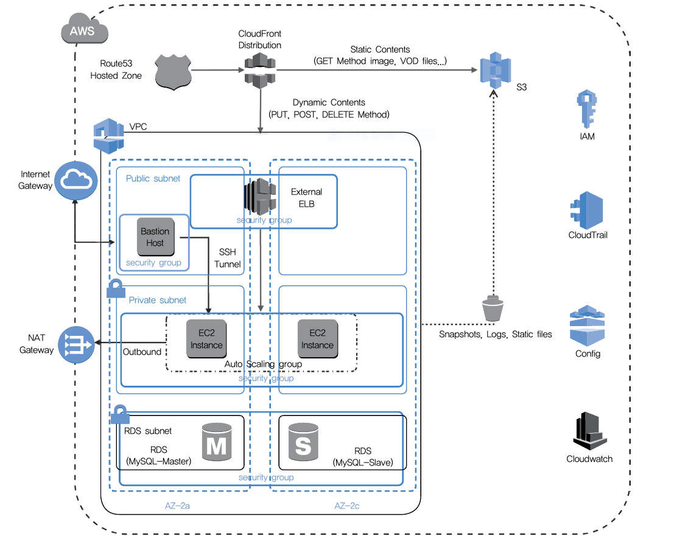

### 20200115 2일차 AWS 정리

- AWS계정 - 기본적으로 root계정으로 접근
- IAM으로 계정관리 - USER 구분(권한없음)
  - role을 USER에게 권한부여 ex) ec2full access
  - access key를 사용하여 인증 - role방식을 추천
  - role은 몇가지 목적을 가지고 적용가능
  - 이 role은 EC2를 생성할 때 assign해준다
  - 가상의 토큰을 관리하는 글로벌 서비스 - Dynamic Token Service(STS)

- AWS서비스 

  - 관리형 서비스

    - Elastic Beanstalk(PaaS) : AWS에서 관리(고가의 비용)
    - DynamoDB : DB as a Service
    - RDS
    - cf) Openstack에서는 Manila, Twlve, swift 

  - DIY 서비스(EC2기반)

    - IaaS(Cloud formation) : 관리는 고객이 직접 해야 한다.

    

  - Global 서비스 : Route53, IAM, STS, Cloud Front Service(CDS)

  - Region 서비스 : S3, Cloud Trail, EFS

  - AV Zone 서비스 : EC2, EBS 등등

- VPC를 생성하게 되면 local 라우팅 테이블이 생성된다. 

- Subnet : VPC주소를 분할해서 사용한다. 
  - VPC는 대개 A클래스를 사용한다. 10.0.0.0/16으로 분할하여 서브넷을 사용
  - 2개의 호스트 주소를 일부 서브넷으로 전환해서 사용 가능 - Public, Private, DB 서브넷으로 분할함
  - Private 서브넷은 사설 IP가 부여되기 때문에 인/아웃바운드가 불가 --> Public 망이 필요함. 기존에 존재하는 로컬 라우팅 테이블 서브넷에 존재 유무에 따라 엔트리를 추가해야 한다(바깥으로 나갈 수 있도록)
- AWS의 로드밸런서
  - ELB : L4스위치(Virtual IP 지원 - Static IP 지원) - 인증 도메인 주소 할당받음
    - Target group으로 EC2를 지정할 수도 있고, Auto Scaling을 통해 그룹을 자동으로 관리도 가능 
    - 인바운드는 여기로 들어옴
  - ALB : L7스위치
- Bastorn host : EC2 전문 host. ssh 게이트웨이. 내부 인스턴스에 접속하기 위해서는 여기를 거쳐야 한다.
  
  