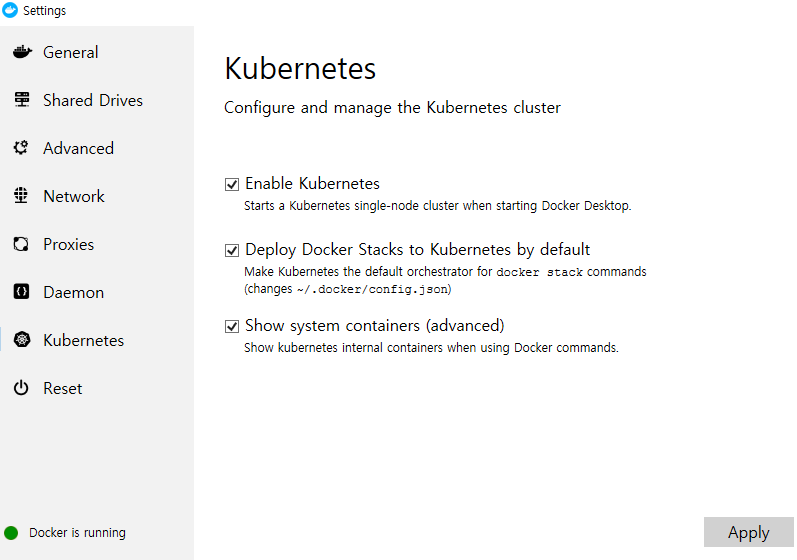

## Kubernetes

- `Docker Container` 운영을 자동화하기 위한 컨테이너 오케스트레이션 툴
  - 컨테이너 배포 및 배치 전략
  - Scale in/Scale out
  - Service discovery
  - 기타 운용
  - 사용이 어렵지만 기능이 매우 많다.
- `Docker`에 정식으로 통합된 사실상 표준
- Swarm : 여러 대의 호스트를 묶어 기초적인 컨테이너 오케스트레이션 기능 제공, 간단한 멀티 컨테이너 구축
- Kubernetes : Swarm보다 복잡하고 많은 기능을 제공


#### Kubernetes 설치

- 


- `Kubectl` : Kubernetes를 다루기 위한 Command Line Interface

  - 설치 : https://storage.googleapis.com/kubernetes-release/release/v1.17.0/bin/windows/amd64/kubectl.exe

  - cmd 창에서 kubectl.exe 를 하면 설치가 된다

  - 이후 kubectl proxy를 입력

    ```powershell
    C:\Users\HPE\Work\docker>kubectl proxy
    Starting to serve on 127.0.0.1:8001
    ```

- `Dashboard` 사용 : 190p에서 접속하라는 URL로 접속하면 된다.

