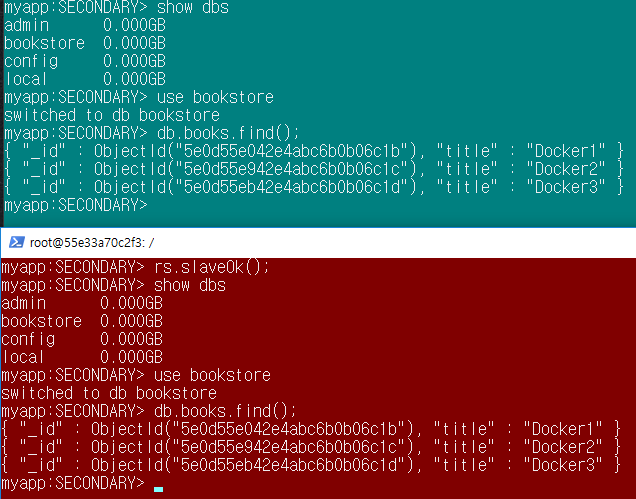

## MongoDB 연동&실습


- 이미지 받아오기

  ```bash
  $ docker pull mongo(or $ docker pull mongo:4.1)
  ```

  - 버전을 따로 명시하지 않으면 latest 버전을 가지고 온다.

- 기동

  ```bash
  $ docker run --name mongodb_server -v/home/test/mongodb/db:/data/db -d -p 16010:27017 mongo -auth
  ```

  - `mongo` : 다운받아온 이미지의 이름
  - `-auth` : mongo db 사용할 때 id와 pw없이 쓰겠다는 의미
  - `-v` : volume mount를 하는 의미.
  - Window에서는 NFS 파일 시스템이 들어가있지 않기 때문에 보류

>    **실습** : *일단 이번시간에는 mount를 걸지 않고 db만 생성*

  ```bash
    $ docker run --name mongodb_server -d -p 16010:27017 mongo
   e045f371865e739c0e7a0edc8effdff024ce9b579cbc557f7ed14c1c8eb03c90
  ```

  프로세스를 확인해보면 다음과 같다

  ```bash
  $ docker ps
  CONTAINER ID        IMAGE               COMMAND                  CREATED             
  e045f371865e        mongo               "docker-entrypoint.s…"   11 minutes ago
  
  STATUS              PORTS                      NAMES
  Up 11 minutes       0.0.0.0:16010->27017/tcp   mongodb_server
  
  ```


​	*아래 문장은 아직 실행 하지 않았음*

  ```bash
  $ docker run -d --name mongodb-test -p 17017:27017 -v /home/sa/data/mongod.conf:/etc/mongod.conf -v/home/sa/data/db:/data/db mongo --config/etc/mongod.conf
  ```

  - volume mount를 2개 걸어놨음.(호스트에 있는 mongod.conf와 도커에 있는 mongod.conf) 호스트 PC에서 작업하던 내용을 컨테이너에 있는 파일에서도 확인 가능
    
- Bash 접근, Mongo 접속

  ```bash
  $ (winpty) docker exec -it mongodb_server bash
  root@XXXYXYZYX $ mongo
  ```

  - `mongodb_server` 는 위의 기동에서 `name`으로 설정한 이름임

- 관리자 계정 접속

  ```bash
  mongo> use admin
  ```

  

## ReplicaSet 설정

  - ReplicaSet 설정을 위해 mongodb를 추가 생성한다.

    - 각 mongodb의 이름은`mongodb_server_1`,   `mongodb_server_2`, `mongodb_server_3`

      ```bash
      # replSet 추가
      $ docker run --name mongodb_server_1 -d -p 16010:27017 mongo --replSet myapp
      $ docker run --name mongodb_server_2 -d -p 26010:27017 mongo --replSet myapp
      $ docker run --name mongodb_server_3 -d -p 36010:27017 mongo --replSet myapp
      ```

      ```bash
      # docker ps로 컨테이너 상태 확인
      CONTAINER ID        IMAGE               COMMAND                  CREATED            
      9bad8c18acc2        mongo               "docker-entrypoint.s…"   31 seconds ago    STATUS              PORTS                      NAMES 
      
      Up 28 seconds       0.0.0.0:16010->27017/tcp   mongodb_server_1
      
      d38628569a6e        mongo               "docker-entrypoint.s…"   2 minutes ago       Up 2 minutes        0.0.0.0:26010->27017/tcp   mongodb_server_2
      55e33a70c2f3        mongo               "docker-entrypoint.s…"   2 minutes ago       Up 2 minutes        0.0.0.0:36010->27017/tcp   mongodb_server_3
      ```
    ```bash
      # 각 서버에 접속
      $ docker exec -it mongodb_server_1 bash
      $ docker exec -it mongodb_server_2 bash
      $ docker exec -it mongodb_server_3 bash
    ```

  - `mongodb_server_1`(Master)로 접속
    
    - `rs.initiate()`
    - `rs.add("mongodb_server_2의 ip : 27017")`
    - `rs.add("mongodb_server_3의 ip : 27017")`

> mongodb_server의 ip 확인 방법 
>
> - 각 서버의 컨테이너 id 확인 --> `docker inspect CONTAINERID` 로 ip 확인 	
>   - `mongodb_server_1의 ip ` : 172.17.0.4
>   - `mongodb_server_2의 ip ` : 172.17.0.3
>   - `mongodb_server_3의 ip ` : 172.17.0.2 


*db.isMaster()* 

```bash
myapp:PRIMARY> rs.initiate()
{
        "operationTime" : Timestamp(1577931464, 1),
        "ok" : 0,
        "errmsg" : "already initialized", # 이미 초기화 한번 했었음
        "code" : 23,
        "codeName" : "AlreadyInitialized",
        "$clusterTime" : {
                "clusterTime" : Timestamp(1577931464, 1),
                "signature" : {
                        "hash" : BinData(0,"AAAAAAAAAAAAAAAAAAAAAAAAAAA="),
                        "keyId" : NumberLong(0)
                }
        }
}
myapp:PRIMARY> rs.add("172.17.0.3:27017")  # errmsg는 아마 이전에 add 했는데 또 add해서인듯. isMaster()를 확인해보면 정상적으로 추가됭
{
        "operationTime" : Timestamp(1577931494, 1),
        "ok" : 0,
        "errmsg" : "Found two member configurations with same host field, members.1.host == members.2.host == 172.17.0.3:27017", 
        "code" : 103,
        "codeName" : "NewReplicaSetConfigurationIncompatible",
        "$clusterTime" : {
                "clusterTime" : Timestamp(1577931494, 1),
                "signature" : {
                        "hash" : BinData(0,"AAAAAAAAAAAAAAAAAAAAAAAAAAA="),
                        "keyId" : NumberLong(0)
                }
        }
}
myapp:PRIMARY> rs.add("172.17.0.2:27017")
{
        "ok" : 1,
        "$clusterTime" : {
                "clusterTime" : Timestamp(1577931499, 1),
                "signature" : {
                        "hash" : BinData(0,"AAAAAAAAAAAAAAAAAAAAAAAAAAA="),
                        "keyId" : NumberLong(0)
                }
        },
        "operationTime" : Timestamp(1577931499, 1)
}
myapp:PRIMARY> db.isMaster()
{
        "hosts" : [
                "9bad8c18acc2:27017",
                "172.17.0.3:27017",
                "172.17.0.2:27017"
        ],
        "setName" : "myapp",
        "setVersion" : 3,
        "ismaster" : true,
        "secondary" : false,
        "primary" : "9bad8c18acc2:27017",
        "me" : "9bad8c18acc2:27017",
        "electionId" : ObjectId("7fffffff0000000000000001"),
        "lastWrite" : {
                "opTime" : {
                        "ts" : Timestamp(1577931499, 1),
                        "t" : NumberLong(1)
                },
                "lastWriteDate" : ISODate("2020-01-02T02:18:19Z")
        },
        "maxBsonObjectSize" : 16777216,
        "maxMessageSizeBytes" : 48000000,
        "maxWriteBatchSize" : 100000,
        "localTime" : ISODate("2020-01-02T02:18:23.733Z"),
        "logicalSessionTimeoutMinutes" : 30,
        "connectionId" : 5,
        "minWireVersion" : 0,
        "maxWireVersion" : 8,
        "readOnly" : false,
        "ok" : 1,
        "$clusterTime" : {
                "clusterTime" : Timestamp(1577931499, 1),
                "signature" : {
                        "hash" : BinData(0,"AAAAAAAAAAAAAAAAAAAAAAAAAAA="),
                        "keyId" : NumberLong(0)
                }
        },
        "operationTime" : Timestamp(1577931499, 1)
}
```


### Primary 서버와 Secondary 서버 동기화

- 1번 서버에 bookstore 추가 및 테이블 생성

  ```bash
  myapp:PRIMARY> use bookstore
  switched to db bookstore
  myapp:PRIMARY> db.books.save({title:"Docker1"});
  WriteResult({ "nInserted" : 1 })
  myapp:PRIMARY> db.books.save({title:"Docker2"});
  WriteResult({ "nInserted" : 1 })
  myapp:PRIMARY> db.books.save({title:"Docker3"});
  WriteResult({ "nInserted" : 1 })
  myapp:PRIMARY> db.books.find()
  { "_id" : ObjectId("5e0d55e042e4abc6b0b06c1b"), "title" : "Docker1" }
  { "_id" : ObjectId("5e0d55e942e4abc6b0b06c1c"), "title" : "Docker2" }
  { "_id" : ObjectId("5e0d55eb42e4abc6b0b06c1d"), "title" : "Docker3" }
  ```

  

- 2번 서버에 접속해서 bookstore db가 있는지 확인

  ```bash
  > show dbs
  2020-01-02T02:31:54.241+0000 E  QUERY    [js] uncaught exception: Error: listDatabases failed:{
          "operationTime" : Timestamp(0, 0),
          "ok" : 0,
          "errmsg" : "not master and slaveOk=false",
          "code" : 13435,
          "codeName" : "NotMasterNoSlaveOk",
          "$clusterTime" : {
                  "clusterTime" : Timestamp(1577932304, 1),
                  "signature" : {
                          "hash" : BinData(0,"AAAAAAAAAAAAAAAAAAAAAAAAAAA="),
                          "keyId" : NumberLong(0)
                  }
          }
  } :
  ```

  - `"codeName" : "NotMasterNoSlaveOk"`  오류가 발생하므로 `rs.slaveOk();`를 입력
  - 하지만 이래도 bookstore DB가 보이지 않는다.
  - `docker logs CONTAINER ID`를 확인해보자

- 2번 서버의 로그를 확인해보면

> `2020-01-02T02:34:29.935+0000 I  CONNPOOL [Replication] Connecting to 9bad8c18acc2:27017` 라는메시지가 계속 출력된다.
>
>  `9bad8c18acc2`는 마스터의 컨테이너 id이고, 이것은 지금 마스터랑 연결이 안되있다는 것을 의미한다. 

- 마스터로 가서 `cfg=rs.conf();`를 실행시킨다. 

```bash
myapp:PRIMARY> cfg = rs.conf();
{
        "_id" : "myapp",
        "version" : 3,
        "protocolVersion" : NumberLong(1),
        "writeConcernMajorityJournalDefault" : true,
        "members" : [
                {
                        "_id" : 0,
                        "host" : "9bad8c18acc2:27017", # 여기가 문제 컨테이너ID:포트로 되어있음
                        "arbiterOnly" : false,
                        "buildIndexes" : true,
                        "hidden" : false,
                        "priority" : 1,
                        "tags" : {

                        },
                        "slaveDelay" : NumberLong(0),
                        "votes" : 1
                },
                {
                        "_id" : 1,
                        "host" : "172.17.0.3:27017", # ip주소:포트
                        "arbiterOnly" : false,
                        "buildIndexes" : true,
                        "hidden" : false,
                        "priority" : 1,
                        "tags" : {

                        },
                        "slaveDelay" : NumberLong(0),
                        "votes" : 1
                },
                {
                        "_id" : 2,
                        "host" : "172.17.0.2:27017", # ip주소:포트
                        "arbiterOnly" : false,
                        "buildIndexes" : true,
                        "hidden" : false,
                        "priority" : 1,
                        "tags" : {

                        },
                        "slaveDelay" : NumberLong(0),
                        "votes" : 1
                }
        ],
        "settings" : {
                "chainingAllowed" : true,
                "heartbeatIntervalMillis" : 2000,
                "heartbeatTimeoutSecs" : 10,
                "electionTimeoutMillis" : 10000,
                "catchUpTimeoutMillis" : -1,
                "catchUpTakeoverDelayMillis" : 30000,
                "getLastErrorModes" : {

                },
                "getLastErrorDefaults" : {
                        "w" : 1,
                        "wtimeout" : 0
                },
                "replicaSetId" : ObjectId("5e0d4f2e6bc92324b65a9274")
        }
}
```

> members를 확인해보면 첫번째 멤버인  `_id : 0` 의 host 이름이 ip주소가 아니라 *컨테이너 id*로 되어있다.  host의 이름을 ip_address로 바꾸면 된다. 


- 이를 위해 다음과 같이 명령어를 입력한다.

```bash
myapp:PRIMARY> cfg.members[0].host="172.17.0.4:27017"
```

- 명령어 입력 후 config를 재설정해준다.

```bash
myapp:PRIMARY> rs.reconfig(cfg);
{
        "ok" : 1,
        "$clusterTime" : {
                "clusterTime" : Timestamp(1577932845, 1),
                "signature" : {
                        "hash" : BinData(0,"AAAAAAAAAAAAAAAAAAAAAAAAAAA="),
                        "keyId" : NumberLong(0)
                }
        },
        "operationTime" : Timestamp(1577932845, 1)
}
```


이제 다시 db.isMaster()를 해보자

```b
myapp:PRIMARY> db.isMaster()
{
        "hosts" : [
                "172.17.0.4:27017", 
                "172.17.0.3:27017",
                "172.17.0.2:27017"
        ],
        "setName" : "myapp",
        "setVersion" : 4,
        "ismaster" : true,
        "secondary" : false,
        "primary" : "172.17.0.4:27017",
        "me" : "172.17.0.4:27017",
        "electionId" : ObjectId("7fffffff0000000000000001"),
        "lastWrite" : {
                "opTime" : {
                        "ts" : Timestamp(1577932884, 1),
                        "t" : NumberLong(1)
                },
                "lastWriteDate" : ISODate("2020-01-02T02:41:24Z"),
                "majorityOpTime" : {
                        "ts" : Timestamp(1577932884, 1),
                        "t" : NumberLong(1)
                },
                "majorityWriteDate" : ISODate("2020-01-02T02:41:24Z")
        },
        "maxBsonObjectSize" : 16777216,
        "maxMessageSizeBytes" : 48000000,
        "maxWriteBatchSize" : 100000,
        "localTime" : ISODate("2020-01-02T02:41:28.356Z"),
        "logicalSessionTimeoutMinutes" : 30,
        "connectionId" : 9,
        "minWireVersion" : 0,
        "maxWireVersion" : 8,
        "readOnly" : false,
        "ok" : 1,
        "$clusterTime" : {
                "clusterTime" : Timestamp(1577932884, 1),
                "signature" : {
                        "hash" : BinData(0,"AAAAAAAAAAAAAAAAAAAAAAAAAAA="),
                        "keyId" : NumberLong(0)
                }
        },
        "operationTime" : Timestamp(1577932884, 1)
}
```

- 호스트가 컨테이너 id가 아니라 ip주소들로 다 바뀌었다.

- 이제 2번(녹색), 3번(빨간색) 서버로 가서 확인해보자



- 동기화가 되어있는 모습을 볼 수 있다.