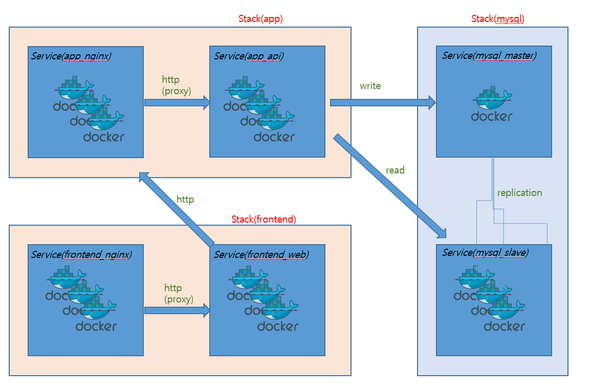

## Docker Swarm을 이용한 실전애플리케이션 개발 - TODO App

### 아키텍처



------


### 배치 전략


------


### TODO overlay network 구축

- create network

  ```powershell
  PS C:\Users\HPE> docker container exec -it manager sh
  / # docker network create --driver=overlay --attachable todoapp
  80bpj4cyex4h91eqzlbu9ns9u
  ```

- 생성된 네트워크 확인(`80bpj4cyex4h        todoapp              overlay             swarm`)

  ```powershell
  / # docker network ls
  NETWORK ID          NAME                 DRIVER              SCOPE
  797e17ef3adf        bridge               bridge              local
  tmiu9rmpk30c        ch03                 overlay             swarm
  98edfadd5f8a        docker_gwbridge      bridge              local
  fae88880bfdf        host                 host                local
  t9oq7k8wwvl0        ingress              overlay             swarm
  a60b1b6c2f53        none                 null                local
  80bpj4cyex4h        todoapp              overlay             swarm
  m19s39jh4hmf        visualizer_default   overlay             swarm
  ```

  

------


### MySQL 서비스 구축

1. Master/Slave 구조 구축

- `todo-mysql.yml` 파일은 stack 폴더에 복붙 해놓는다`C:\Users\HPE\Work\docker\day03\swarm\todo\tododb\etc\mysql\mysql.conf` 확인  

- `log-bin=/var/log/mysql/mysql-bin.log`를 사용해서 바이너리 로그 파일을 만들겠다.

- 이미지 생성

  - 폴더를 `C:\Users\HPE\Work\docker\day03\swarm\todo\tododb`로 이동한다.(`Dockerfile`이 있는 위치)
  - 빌드 실행 : `docker build -t ch04/tododb:latest .`

  

- 빌드가 된 `tododb`를 로컬호스트에 등록 & push

  - `docker tag ch04/tododb:latest localhost:5000/ch04/tododb:latest`
  - `docker push localhost:5000/ch04/tododb:latest`
  - Registry의 이미지 목록은 `localhost:5000/v2/_catalog` 에서 확인가능
   

- 기존에 있던 echo와 ingress stack은 지우자

  - `docker stack rm echo`
  - `docker stack rm ingress`

- `swarm`으로 배포(master 1개, slave 2개) 

  ```powershell
  / # docker stack deploy -c /stack/todo-mysql.yml todo_mysql
  Creating service todo_mysql_slave
  Creating service todo_mysql_master
  ```

- `todo_mysql`에 올라간 서비스확인

```powershell
/ # docker stack services todo_mysql
ID                  NAME                MODE                REPLICAS            IMAGE                              PORTS
dgj73fc7bqbv        todo_mysql_master   replicated          1/1                 registry:5000/ch04/tododb:latest
scqvahvn1jdo        todo_mysql_slave    replicated          0/2                 registry:5000/ch04/tododb:latest
```

*문제 : slave의 replicas가 올라오지 않음*

*--> 해결 : cnf 파일과 sh 파일을 CRLF에서 LF로 바꿈*

- **기존에 만들었던 `image`,  `swarm`, `stack` 전부 지우고 새로 깔자 ** 

  - create network

    ```powershell
    PS C:\Users\HPE> docker container exec -it manager sh
    / # docker network create --driver=overlay --attachable todoapp
    ```

  - `manager`와 `worker`  `join`시키기

    - `manager`에서 토큰 발급

    ```powershell
    PS C:\Users\HPE> docker exec -it manager docker swarm init
    Swarm initialized: current node (pq0qlz0lliwn86ntarzm7kd8m) is now a manager.
    
    To add a worker to this swarm, run the following command:
    
       docker swarm join --token SWMTKN-1-1rl2nengjgp71bhjmbr1sw9jdczz415uk13afo53ymweup1a9n-cjfndrl3ylib0mq6axwm33vts 172.22.0.3:2377
    
    To add a manager to this swarm, run 'docker swarm join-token manager' and follow the instructions.
    ```

    - `worker01`부터 `worker03`까지 `swarm join` 반복 실행

    ```powershell
    # worker01
    PS C:\Users\HPE> docker exec -it worker01 sh
    / # docker swarm join --token SWMTKN-1-1rl2nengjgp71bhjmbr1sw9jdczz415uk13afo53ymweup1a9n-cjfndrl3ylib0mq6axwm33vts 172.22.0.3:2377
    This node joined a swarm as a worker.
    
    # worker02
    PS C:\Users\HPE> docker exec -it worker02 sh
    / # docker swarm join --token SWMTKN-1-1rl2nengjgp71bhjmbr1sw9jdczz415uk13afo53ymweup1a9n-cjfndrl3ylib0mq6axwm33vts 172.22.0.3:2377
    This node joined a swarm as a worker.
    
    
    # worker03
    PS C:\Users\HPE> docker exec -it worker03 sh
    / # docker swarm join --token SWMTKN-1-1rl2nengjgp71bhjmbr1sw9jdczz415uk13afo53ymweup1a9n-cjfndrl3ylib0mq6axwm33vts 172.22.0.3:2377
    This node joined a swarm as a worker.
    ```

  - *Dockerfile*빌드 해서 `ch04/tododb:latest` 라는 이름의 이미지 등록

    - `docker image build -t ch04/tododb:latest .` 

  - `localhost:5000/ch04/tododb:latest` 태그 붙여서(`tag` 옵션) 레지스트리 등록(`push`옵션)

    - `docker image tag ch04/tododb:latest localhost:5000/ch04/tododb:latest`
    - `docker image push localhost:5000/ch04/tododb:latest`

  - `Registry`의 이미지 목록은 `localhost:5000/v2/_catalog` 에서 확인가능
  
    
  - MySQL을 사용할 수 있는 이미지 준비 완료

    
    
  - 스웜으로 배포하기

    ```pow
    / # docker stack deploy -c /stack/todo-mysql.yml todo_mysql
    Creating service todo_mysql_master
    Creating service todo_mysql_slave
    ```

    

  - `docker service ls`로 확인
   


- `docker visualizer`에서 확인(localhost:9000)
 

------


### 200106 월요일 Docker Swarm 3일차

- `worker`중 하나인 `84373f5bc629`에 접속해보자

  ```powershell
  PS C:\Users\HPE> docker exec -it 84373f5bc629 sh
  / # docker ps
  CONTAINER ID        IMAGE                              COMMAND                  CREATED             STATUS              PORTS                 NAMES
  c0c5fe0f861a        registry:5000/ch04/tododb:latest   "prehook add-server-…"   2 days ago          Up 2 days           3306/tcp, 33060/tcp   todo_mysql_slave.2.chhnap36beyh7lzxm9aa7ym95
  ```

  - my_sql DB가 설치되어있다

- 각 Node 별 Service(Container) 배치 구조 및 Port 현황(`nginx`까지 구축한 상태)


- 현재 master역할을 하는 worker인 `36a04a6853cc`에 접속

  - manager로 들어간 shell에서 `docker service ls`를 해보면 master를 가지고 있는 worker01의 서비스들이 보인다. 

    ```powershell
    / # docker service ls
    ID                  NAME                MODE                REPLICAS            IMAGE                              PORTS
    2gv9nhhexupw        todo_mysql_master   replicated          1/1                 registry:5000/ch04/tododb:latest
    ml8lnf6v6bb1        todo_mysql_slave    replicated          2/2                 registry:5000/ch04/tododb:latest
    2ftpe44dltmn        visualizer_app      global              1/1                 dockersamples/visualizer:latest    *:9000->8080/tcp
    ```

  - `master`의 ID가 `2gv9nhhexupw`이다. 이것의 컨테이너 상태를 봐보자

    ```powershell
    / # docker service ps 2gv9nhhexupw
    ID                  NAME                  IMAGE                              NODE                DESIRED STATE       CURRENT STATE        ERROR               PORTS
    8co1wbfmity6        todo_mysql_master.1   registry:5000/ch04/tododb:latest   36a04a6853cc        Running             Running 2 days ago
    ```

  - 새로운 창에서 master 컨테이너인 `8co1wbfmity6`로 들어가보자


- 표준 출력(책 146p) : `docker exec -it 36a04a6853cc docker exec -it todo_mysql_master.1.8co1wbfmity6950di4blt96dr bash`
  - 윈도우에서 실행

  ```powershell
  PS C:\Users\HPE> docker exec -it 36a04a6853cc docker exec -it todo_mysql_master.1.8co1wbfmity6950di4blt96dr bash
  root@96362baac25e:/# docker ps
  ```


- `master`에 접속

  ```powershell
  PS C:\Users\HPE> docker exec -it manager docker service ps todo_mysql_master --no-trunc --filter "desired-state=running" --format "docker exec -it {{.Node}} docker exec -it {{.Name}}.{{.ID}} bash"
  
  #위의 표준출력을 실행했을 때 나오는 문장 
  docker exec -it 36a04a6853cc docker exec -it todo_mysql_master.1.8co1wbfmity6950di4blt96dr bash
  
  # 그대로 복붙해서 실행시키면 master로 TODODB 접속을 할 수 있다.
  PS C:\Users\HPE> docker exec -it 36a04a6853cc docker exec -it todo_mysql_master.1.8co1wbfmity6950di4blt96dr bash
  ```

  - `todo_mysql_master`에 접속

    ```powershell
    root@96362baac25e:/# ls -al /usr/local/bin
    total 11648
    drwxrwsr-x 1 root staff    4096 Jan  3 09:08 .
    drwxrwsr-x 1 root staff    4096 Dec 24 00:00 ..
    -rwxr-xr-x 1 root root      185 Jan  3 08:54 add-server-id.sh
    lrwxrwxrwx 1 root staff       8 Jan  3 09:08 codep -> entrykit
    -rwxrwxr-x 1 root root    12715 Dec 28 23:00 docker-entrypoint.sh
    -rwxr-xr-x 1 root root  9191600 Jan 21  2016 entrykit
    -rwxr-xr-x 1 root staff 2698808 May 21  2017 gosu
    -rwxr-xr-x 1 root root      130 Jan  3 08:53 init-data.sh
    lrwxrwxrwx 1 root staff       8 Jan  3 09:08 prehook -> entrykit
    lrwxrwxrwx 1 root staff       8 Jan  3 09:08 render -> entrykit
    lrwxrwxrwx 1 root staff       8 Jan  3 09:08 switch -> entrykit
    ```

  - `root@96362baac25e:/# init-data.sh` 실행

  - `root@96362baac25e:/# mysql -ugihyo -p tododb` 접속 `pw : gihyo`

    ```powershell
    mysql> show databases;
    +--------------------+
    | Database           |
    +--------------------+
    | information_schema |
    | tododb             |
    +--------------------+
    ```

    - 

- `slave`에 접속

  ```powershell
  # master에 접속하는것과 동일하지만 todo_mysql_slave 라는 점이 다르다
  PS C:\Users\HPE> docker exec -it manager docker service ps todo_mysql_slave --no-trunc --filter "desired-state=running" --format "docker exec -it {{.Node}} docker exec -it {{.Name}}.{{.ID}} bash"
  
  # 위의 표준출력을 실행했을 때 나오는 문장 : slave가 2개 있으므로 2개나옴
  docker exec -it 1730ee93d7bd docker exec -it todo_mysql_slave.1.dm87ap9zzh9k569hsb6p2annr bash
  docker exec -it 84373f5bc629 docker exec -it todo_mysql_slave.2.chhnap36beyh7lzxm9aa7ym95 bash
  
  # slave중 하나로 접속하자
  PS C:\Users\HPE> docker exec -it 1730ee93d7bd docker exec -it todo_mysql_slave.1.dm87ap9zzh9k569hsb6p2annr bash
  
  ```

  - `todo_mysql_slave`에 접속

    ```powershell
    root@d8327ccab3b4:/# ls -al /usr/local/bin
    total 11648
    drwxrwsr-x 1 root staff    4096 Jan  3 09:08 .
    drwxrwsr-x 1 root staff    4096 Dec 24 00:00 ..
    -rwxr-xr-x 1 root root      185 Jan  3 08:54 add-server-id.sh
    lrwxrwxrwx 1 root staff       8 Jan  3 09:08 codep -> entrykit
    -rwxrwxr-x 1 root root    12715 Dec 28 23:00 docker-entrypoint.sh
    -rwxr-xr-x 1 root root  9191600 Jan 21  2016 entrykit
    -rwxr-xr-x 1 root staff 2698808 May 21  2017 gosu
    -rwxr-xr-x 1 root root      130 Jan  3 08:53 init-data.sh
    lrwxrwxrwx 1 root staff       8 Jan  3 09:08 prehook -> entrykit
    lrwxrwxrwx 1 root staff       8 Jan  3 09:08 render -> entrykit
    lrwxrwxrwx 1 root staff       8 Jan  3 09:08 switch -> entrykit
    ```

  - `root@d8327ccab3b4:/# init-data.sh` 실행

  - `root@d8327ccab3b4:/# mysql -ugihyo -p tododb` 실행

    ```powershell
    mysql> show databases;
    +--------------------+
    | Database           |
    +--------------------+
    | information_schema |
    | tododb             |
    +--------------------+
    ```

    - 

- 포트번호를 쉽게 확인할 수 있도록 worker01의 master node에 들어가서 `apt-get install -y net-tools`를 설치해주자
- 각 노드별 ip, port 번호 확인(visualizer로 현재 상태 확인)


- 우선 Worker01(1730ee93d7bd) 노드로 들어가서 실행중인 서비스(컨테이너)가 어떤 것인지 확인

```powershell
PS C:\Users\HPE\Work\docker\day03\swarm\todo\todoapi> docker exec -it worker01 sh


```

- `Worker01`의 서비스 확인

  ```powershell
  / # docker ps
  CONTAINER ID        IMAGE                               COMMAND                  CREATED             STATUS              PORTS                 NAMES
  c1097b718d21        registry:5000/ch04/todoapi:latest   "todoapi"                26 minutes ago      Up 26 minutes                             todo_app_api.2.75mtrqrxywptguzpcgj73v0sf
  d8327ccab3b4        registry:5000/ch04/tododb:latest    "prehook add-server-…"   2 days ago          Up 2 days           3306/tcp, 33060/tcp   todo_mysql_slave.1.dm87ap9zzh9k569hsb6p2annr
  ```

  - visualizer에서 볼 수 있듯이, todo_app_api와 todo_mysql_slave가 실행되고 있다. 우선 todo_app_api(c1097b718d21)로 들어가보자

- `todo_app_api` 접속 후 ip 확인

- ```powershell
  / # docker exec -it c1097b718d21 bash
  root@c1097b718d21:/# hostname -i
  10.0.2.11
  root@c1097b718d21:/#
  ```

- `todo_app_api` 접속 후 port 확인

- 


- ```powershell
  PS C:\Users\HPE> docker exec -it worker02 sh
  / # docker ps
  CONTAINER ID        IMAGE                              COMMAND                  CREATED             STATUS              PORTS                 NAMES
  c0c5fe0f861a        registry:5000/ch04/tododb:latest   "prehook add-server-…"   2 days ago          Up 2 days           3306/tcp, 33060/tcp   todo_mysql_slave.2.chhnap36beyh7lzxm9aa7ym95
  / # docker exec -it c0c5 mysql -ugihyo -p tododb
  Enter password:
  ```

- 