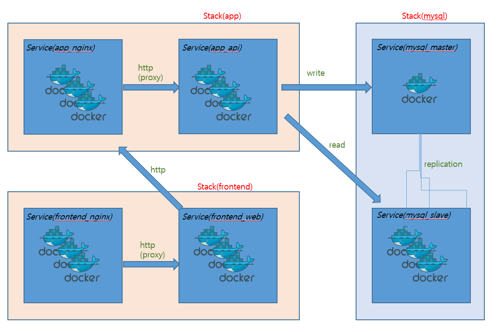
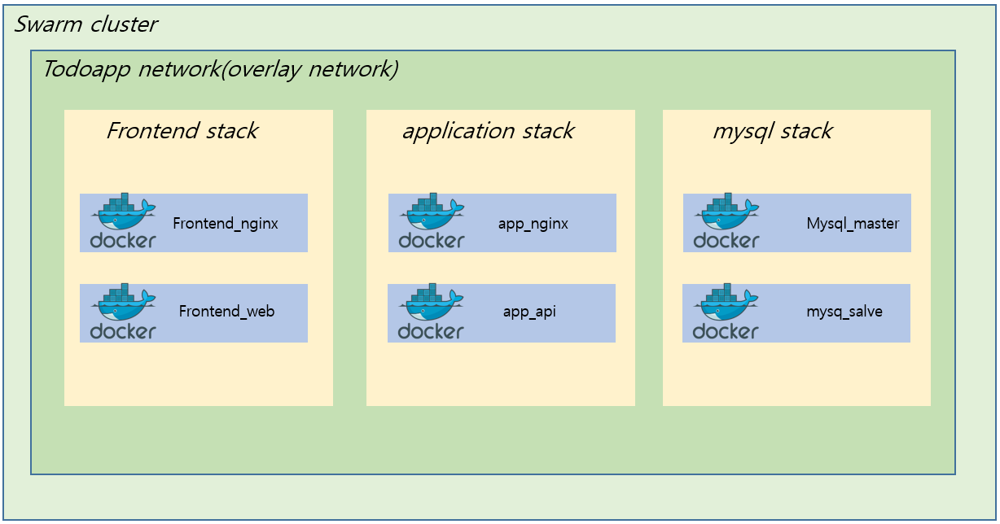
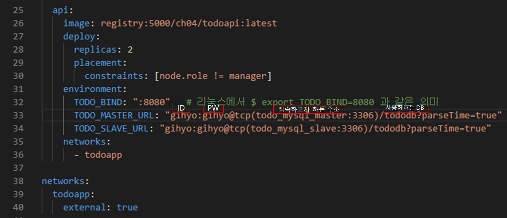

## Docker Swarm을 이용한 실전 애플리케이션 개발 - API 서비스 구축

#### 200106 월요일 

### 아키텍처



------


### 배치 전략 : 현재 mysql stack 까지는 작업 완료. application stack 할 차례




------


### TODO 앱의 도메인 담당

- Go언어로 구현
  - cmd/main.go 실행
    - MySQL 접속에 필요한 환경 변수 값 얻어오기
    - HTTP 요청 핸들러 생성 및 앤드포인트 등록, 서버 실행


*Dockerfile*

```dockerfile
FROM golang:1.10

WORKDIR /
ENV GOPATH /go 

COPY . /go/src/github.com/gihyodocker/todoapi
RUN go get github.com/go-sql-driver/mysql
RUN go get gopkg.in/gorp.v1
RUN cd /go/src/github.com/gihyodocker/todoapi && go build -o bin/todoapi cmd/main.go
RUN cd /go/src/github.com/gihyodocker/todoapi && cp bin/todoapi /usr/local/bin/

CMD ["todoapi"]
```

- *Dockerfile* 을 가지고 이미지 파일을 생성(`build` --> `push`)

  ```powershell
  PS C:\Users\HPE\Work\docker\day03\swarm\todo\todoapi> docker build -t localhost:5000/ch04/todoapi:latest .
  
  .
  .
  .
  
  PS C:\Users\HPE\Work\docker\day03\swarm\todo\todoapi> docker push localhost:5000/ch04/todoapi:latest
  ```

  

- *todo-app.yml*



- `nginx`부분은 아직 설치하지 않을 것이므로 주석처리 해두자
- 
- `manager` 로 들어가서 스택을 설치하고 서비스를 올리자
  - `docker stack deploy -c /stack/todo-app.yml todo_app`

- 서비스 올라갔나 확인 : `todo_app_api` 가 있다.

```powershell
/ # docker service ls
ID                  NAME                MODE                REPLICAS            IMAGE                               PORTS
cl7plexlzel6        todo_app_api        replicated          2/2                 registry:5000/ch04/todoapi:latest
2gv9nhhexupw        todo_mysql_master   replicated          1/1                 registry:5000/ch04/tododb:latest
ml8lnf6v6bb1        todo_mysql_slave    replicated          2/2                 registry:5000/ch04/tododb:latest
2ftpe44dltmn        visualizer_app      global              1/1                 dockersamples/visualizer:latest     *:9000->8080/tcp
```

- `todo_app_api`에서 상세하게 확인

```powershell
/ # docker service ls
ID                  NAME                MODE                REPLICAS            IMAGE                               PORTS
cl7plexlzel6        todo_app_api        replicated          2/2                 registry:5000/ch04/todoapi:latest
2gv9nhhexupw        todo_mysql_master   replicated          1/1                 registry:5000/ch04/tododb:latest
ml8lnf6v6bb1        todo_mysql_slave    replicated          2/2                 registry:5000/ch04/tododb:latest
2ftpe44dltmn        visualizer_app      global              1/1                 dockersamples/visualizer:latest     *:9000->8080/tcp
```


