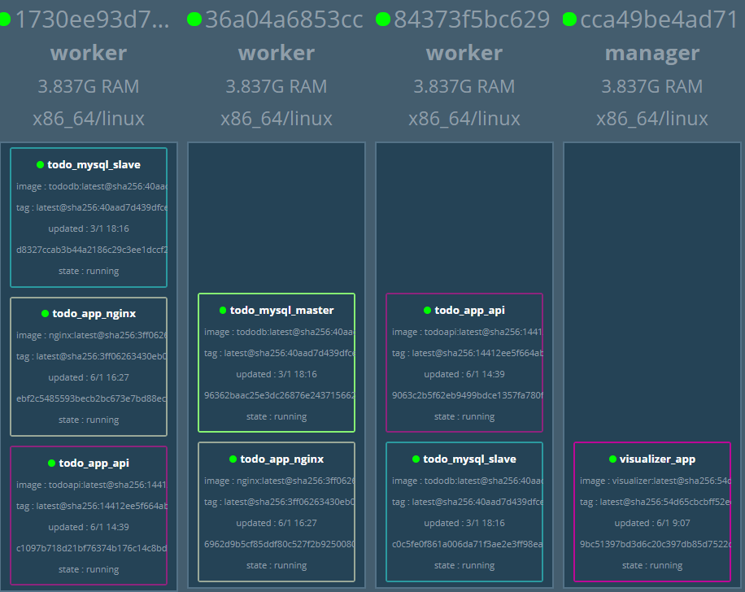

## Docker Swarm 애플리케이션 구축 - Nginx

- nginx를 사용하면 클라이언트의 요청을 백엔드에서 처리하는 속도가 더욱 빨라진다.


- `entrykit` 템플릿을 이용하여 환경 변수 제어
  - {{var "환경 변수명"}}
  - {{var "환경 변수명"|default "기본값"}}


------

#### Nginx 컨테이너의 Dockerfile 실행 및 배포

- 주석으로 막아뒀던 `todo-app.yml` 파일의 주석을 해제하고 다시 실행한다

  - `docker image build -t ch04/nginx:latest .`

    ```powershell
    PS C:\Users\HPE\Work\docker\day03\swarm\todo\todonginx> docker image build -t ch04/nginx:latest .
    Sending build context to Docker daemon  13.31kB
    Step 1/13 : FROM nginx:1.13
    1.13: Pulling from library/nginx
    f2aa67a397c4: Pull complete
    3c091c23e29d: Pull complete
    4a99993b8636: Pull complete
    Digest: sha256:b1d09e9718890e6ebbbd2bc319ef1611559e30ce1b6f56b2e3b479d9da51dc35
    .
    .
    .
    
    ```

  - `docker image tag ch04/nginx:latest localhost:5000/ch04/nginx:latest` 와 `docker image push localhost:5000/ch04/nginx:latest` 실행

    ```powershell
    PS C:\Users\HPE\Work\docker\day03\swarm\todo\todonginx> docker image tag ch04/nginx:latest localhost:5000/ch04/nginx:latest
    PS C:\Users\HPE\Work\docker\day03\swarm\todo\todonginx> docker image push localhost:5000/ch04/nginx:latest
    The push refers to repository [localhost:5000/ch04/nginx]
    ebf57c32e531: Pushed
    f74b9d51be4d: Pushed
    4f0e78c1f98a: Pushed
    4e37de89ed51: Pushed
    97c1fbea0d41: Pushed
    102b3b8c074b: Pushed
    f518425496f1: Mounted from ch04/tododb
    918ec74ccd45: Pushed
    fd0b5df4403f: Pushed
    c294c385a7bf: Pushed
    7ab428981537: Pushed
    82b81d779f83: Pushed
    d626a8ad97a1: Pushed
    latest: digest: sha256:3ff06263430eb0dbf738200c299540ba94be3c625caad304142840599c84979f size: 3039
    ```

  - `docker exec -it manager docker stack deploy -c /stack/todo-app.yml todo_app` 

    ```powershell
    PS C:\Users\HPE\Work\docker\day03\swarm\todo\todonginx> docker exec -it manager docker stack deploy -c /stack/todo-app.yml todo_app
    Updating service todo_app_api (id: cl7plexlzel6cif5qhgjocf6e)
    Updating service todo_app_nginx (id: v1w3mqyh3w2vy7xl1xnk16q7m)
    ```

- visualizer를 통해 컨테이너가 어떻게 올라갔는지 확인해보자

- 

  - `worker01`과 `worker03`에 nginx 컨테이너가 올라갔다. nginx의 ip address와 port를 확인해보자

    - ```powershell
      # ps 명령어를 통해 실행중인 컨테이너의 목록을 확인하고 worker01의 id로 접속으로 하자
      PS C:\Users\HPE\Work\docker\day03\swarm\todo\todonginx> docker ps
      ... 
      PS C:\Users\HPE\Work\docker\day03\swarm\todo\todonginx> docker exec -it 1730ee93d7bd sh
      
      # 접속을 했으면 worker01 컨테이너 위에서 실행중인 컨테이너들이 어떤것들이 있는지 확인하자
      / # docker ps
      CONTAINER ID        IMAGE                               COMMAND                  CREATED             STATUS              PORTS                 NAMES
      ebf2c5485593        registry:5000/ch04/nginx:latest     "render /etc/nginx/n…"   4 minutes ago       Up 4 minutes        80/tcp                todo_app_nginx.2.aaopfn6yb8iwvb07g9ph0y3zp
      c1097b718d21        registry:5000/ch04/todoapi:latest   "todoapi"                2 hours ago         Up 2 hours                                todo_app_api.2.75mtrqrxywptguzpcgj73v0sf
      d8327ccab3b4        registry:5000/ch04/tododb:latest    "prehook add-server-…"   2 days ago          Up 2 days           3306/tcp, 33060/tcp   todo_mysql_slave.1.dm87ap9zzh9k569hsb6p2annr
      
      ```

    - 현재 `todo_app_nginx`, `todo_app_api`, `todo_mysql_slave` 3개의 서비스가 실행중이다. 이 중 `todo_app_nginx`의 ip-address와 port번호를 보기 위해 nginx로 들어가자

      ```powershell
      / # docker exec -it ebf2c5485593 bash
      # ip-address 확인
      root@ebf2c5485593:/# hostname -i
      10.0.2.149
      
      # port번호 확인
      root@ebf2c5485593:/# apt-get update
      ...
      root@ebf2c5485593:/# apt-get install -y net-tools
      ...
      root@ebf2c5485593:/# netstat -ntpl
      
      Proto Recv-Q Send-Q Local Address           Foreign Address         State       PID/Program name
      tcp        0      0 0.0.0.0:8000            0.0.0.0:*               LISTEN      1/nginx: master pro
      tcp        0      0 127.0.0.11:40561        0.0.0.0:*               LISTEN      -
      ```

      - 8000port를 사용하는 것을 알 수 있다.

- todo_app_api가 없는 컨테이너에 가서 db에 접근해보자

  - 

#### 웹 서비스 구축

- 


