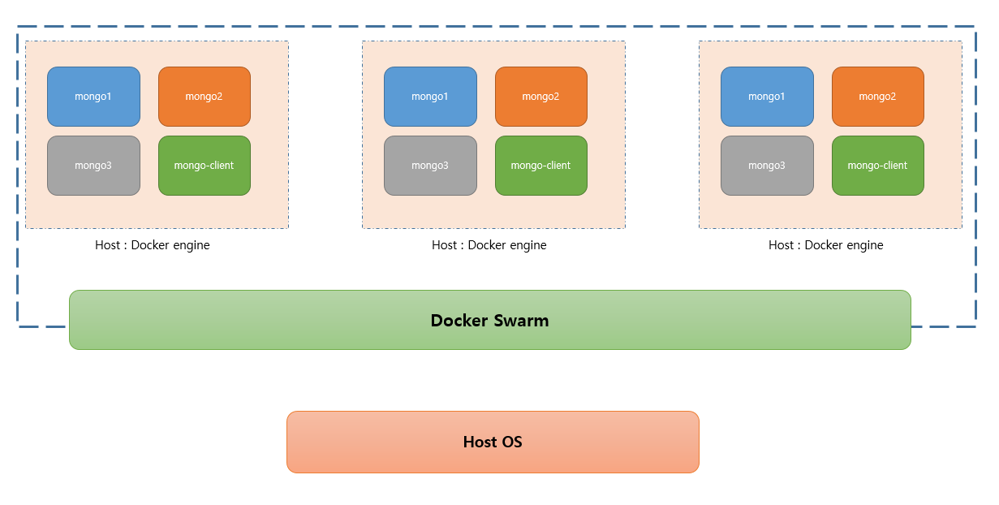
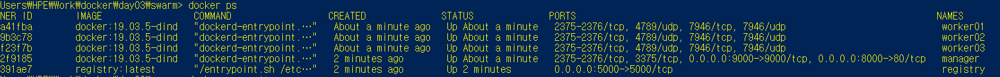
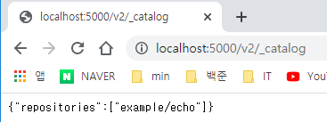
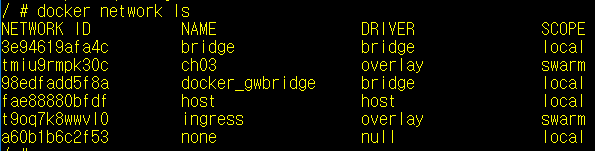

## Docker Swarm

- Docker Swarm --> 오케스트레이션
  - 여러 docker host를 클러스터로 묶어주는 컨테이너 오케스트레이션

|  이름   |                             역할                             | 대응하는 명령어 |
| :-----: | :----------------------------------------------------------: | :-------------: |
| Compose | 여러 컨테이너로 구성된 도커 애플리케이션을 관리(단일 호스트) | docker-compose  |
|  Swarm  |              클러스터 구축 및 관리(멀티 호스트)              |  docker swarm   |
| Service | 스웜에서 클러스터 안의 서비스(컨테이너 하나 이상의 집합)를 관리 | docker service  |
|  Stack  |   스웜에서 여러개의 서비스를 합한 전체 애플리케이션을 관리   |  docker stack   |



- Docker in Docker(Dind)
  - 19.03.5-dind 버전의 도커 사용 (https://hub.docker.com/_/docker)

- Manager에 Swarm 설정
  - https 등록
  - --insecure-registry registry :5000
- `docker-compose.yml` 파일 작성 [강사님 github에서 가져옴](https://github.com/joneconsulting/cloud-computing/tree/master/04.Docker/swarm)

*docker-compose.yml*

```bash
version: "3"
services: 
  registry:
    container_name: registry
    image: registry:latest
    ports: 
      - 5000:5000
    volumes: 
      - "./registry-data:/var/lib/registry"

  manager:
    container_name: manager
    image: docker:19.03.5-dind
    privileged: true
    tty: true
    ports:
      - 8000:80
      - 9000:9000
    depends_on: 
      - registry
    expose: 
      - 3375
    command: "--insecure-registry registry:5000"
    volumes: 
      - "./stack:/stack"

  worker01:
    container_name: worker01
    image: docker:19.03.5-dind
    privileged: true
    tty: true
    depends_on: 
      - manager
      - registry
    expose: 
      - 7946
      - 7946/udp
      - 4789/udp
    command: "--insecure-registry registry:5000"

  worker02:
    container_name: worker02
    image: docker:19.03.5-dind
    privileged: true
    tty: true
    depends_on: 
      - manager
      - registry
    expose: 
      - 7946
      - 7946/udp
      - 4789/udp
    command: "--insecure-registry registry:5000"

  worker03:
    container_name: worker03
    image: docker:19.03.5-dind
    privileged: true
    tty: true
    depends_on: 
      - manager
      - registry
    expose: 
      - 7946
      - 7946/udp
      - 4789/udp
    command: "--insecure-registry registry:5000"
      
```

- `docker-compose up` 실행

  - 윈도우에 비밀번호가 걸려있지 않으면 에러가 발생

  - 사용자 계정에 비밀번호를 설정하고 Docker setting에서 Share Drives의 C 드라이브를 shared해주자
    

    

  

- manager 접속

  - ```bash
    PS C:\Users\HPE\Work\docker\day03\swarm> docker exec -it manager docker swarm init
    ```

    - `docker`명령어가 2번 나온다. `docker swarm init` 이라는 명령어를 `manager`에게 전달한다는 의미

  - manager 의 ps 확인

    ```bash
    PS C:\Users\HPE\Work\docker\day03\swarm> docker exec -it manager docker ps
    CONTAINER ID        IMAGE               COMMAND             CREATED             STATUS              PORTS               NAMES
    ```

    

  - manager의 network 확인

  - swarm의 초기화 작업 실행

    ```bash
    PS C:\Users\HPE\Work\docker\day03\swarm> docker exec -it manager docker swarm init
    Swarm initialized: current node (pq0qlz0lliwn86ntarzm7kd8m) is now a manager.
    
    To add a worker to this swarm, run the following command:
    
        docker swarm join --token SWMTKN-1-6532xt0g71lhnxerecijc7bd7rci2c3104wqbr5i6jho7aodsz-5h7hxozdb8ls5bbo2j9q6mqdw 172.21.0.3:2377
    
    To add a manager to this swarm, run 'docker swarm join-token manager' and follow the instructions.
    ```

- worker와 join

  - 위에 `docker swarm join --token SWMTKN-1-6532xt0g71lhnxerecijc7bd7rci2c3104wqbr5i6jho7aodsz-5h7hxozdb8ls5bbo2j9q6mqdw 172.21.0.3:2377` 부분을 복붙해서 `worker01`부터 `worker03`까지 `manager`와 `join` 시켜준다.

    ```bash
    # woker01 join
    PS C:\Users\HPE\Work\docker\day03\swarm> docker exec -it worker01 docker swarm join --token SWMTKN-1-6532xt0g71lhnxerecijc7bd7rci2c3104wqbr5i6jho7aodsz-5h7hxozdb8ls5bbo2j9q6mqdw 172.21.0.3:2377
    This node joined a swarm as a worker.
    
    # worker02 join
    PS C:\Users\HPE\Work\docker\day03\swarm> docker exec -it worker02 docker swarm join --token SWMTKN-1-6532xt0g71lhnxerecijc7bd7rci2c3104wqbr5i6jho7aodsz-5h7hxozdb8ls5bbo2j9q6mqdw 172.21.0.3:2377
    This node joined a swarm as a worker.
    
    # worker03 join
    PS C:\Users\HPE\Work\docker\day03\swarm> docker exec -it worker03 docker swarm join --token SWMTKN-1-6532xt0g71lhnxerecijc7bd7rci2c3104wqbr5i6jho7aodsz-5h7hxozdb8ls5bbo2j9q6mqdw 172.21.0.3:2377
    This node joined a swarm as a worker.
    ```

  - `docker exec -it manager docker node ls`를 통해 상태 확인
  
    - `docker node ls` 명령어는 매니저만 실행 가능

```bash
PS C:\Users\HPE\Work\docker\day03\swarm> docker exec -it manager docker node ls
ID                            HOSTNAME            STATUS              AVAILABILITY        MANAGER STATUS      ENGINE VERSION
pq0qlz0lliwn86ntarzm7kd8m *   102e232f9185        Ready               Active              Leader              19.03.5
wgs00ylcj39dgwcjs9ds6b1gh     442d47f23f7b        Ready               Active                                  19.03.5
u35ivn0q1kc47op9plsr9hld1     869082a41fba        Ready               Active                                  19.03.5
k2fzc718ymgz8ggigoijvuaf9     f53f0c9b3c78        Ready               Active                                  19.03.5
```

------


### 200103 Docker Swarm 2일차

- Manager에 Swarm 설정

- day01의 Dockerfile의 내용을 수정

  *Dockerfile*

  ```bash
  FROM golang:1.10
  
  RUN mkdir /echo
  COPY main.go /echo
  
  CMD ["go", "run", "/echo/main.go"]
  
  ```

- 빌드 실행 : `docker build -t example/echo:latest .`

  - `-t`는 태그 명령어로 이름을 example/echo에 태그를 latest로 달아주는 것을 의미

- 도커 레지스트리용 이미지 생성

  - `docker tag example/echo:latest localhost:5000/example/echo:latest`
    - `tag`명령어는 앞의 명령어를 복사해서 뒤의 이름으로 이미지를 만든다

- 도커 레지스트리용 이미지 등록

  - `docker push localhost:5000/example/echo:latest`
  - localhost:5000/v2/_catalog 접속
  - 

- 이렇게 하면 `docker pull registry:5000/example/echo` 로 이미지를 다운받아 올 수 있다.

- worker 컨테이너에 이미지 설치

  - worker01로 shell에 접속하여 레지스트리용 이미지 `localhost:5000/example/echo:latest` 받아오기

  ```bash
  PS C:\Users\HPE> docker exec -it worker01 sh
  / # docker pull registry:5000/example/echo:latest
  ```

  또는 

  ```bash
  PS C:\Users\HPE> docker exec -it worker01 docker pull registry:5000/example/echo:latest
  ```

  - worker02, 03도 마찬가지로 가능하다.

    

------

### Swarm 초기화 방법

- 매니저에 접속 - `docker exec -it manager sh`

- 우선 스웜을 떠난다 `--force`는 강제 종료 키워드

  ```bash
  / # docker swarm leave --force
  ```

- 스웜 초기화&토큰 발급

  ```bash
  
  / # docker swarm init
  Swarm initialized: current node (uswlpjty9bzngnundrn11kggr) is now a manager.
  
  To add a worker to this swarm, run the following command:
  
      docker swarm join --token SWMTKN-1-0xj2p45gd0xtxft3w6c74hn2rmww8zy9okzbo1fdj1uqcxu4ac-a4wbzy2urfr7byosk7zezr5go 172.21.0.3:2377
  ```

- worker01에 접속, 기존 swarm 삭제, 새롭게 발급된 토큰으로 join

  ```bash
  PS C:\Users\HPE> docker exec -it worker01 sh
  / # docker swarm leave
  Node left the swarm.
  / # docker swarm join --token SWMTKN-1-0xj2p45gd0xtxft3w6c74hn2rmww8zy9okzbo1fdj1uqcxu4ac-a4wbzy2urfr7byosk7zezr5go 172.21.0.3:2377
  This node joined a swarm as a worker.
  ```

  - worker02와 03도 똑같이 해준다.


------

### Docker Service

- Service : 어플리케이션을 구성하는 일부 컨테이너를 제어하기 위한 단위. 스웜으로 관리

- 레플리케이션을 여러개 만들어 놓으면 하나의 DB에 문제가 생겼을 때 복구하기 쉽고, 많은 데이터 요청이 들어왔을 때 빠르게 처리 가능하다.

- ```bash
  $ docker exit -it manager docker service ls
  ```

  - repleica setting을 6개로 늘린다는 의미

  ```bash
  $ docker exit -it manager docker service scale echo=6
  ```

  - echo라는 프로세스가 어떤것인지 출력

  ```bash
  $ docker exit -it manager docker service ps echo
  ```

  - 서비스 삭제

  ```bash
  $ docker exit -it manager docker service rm echo
  ```

  

  >  매니저로 이동해서 실습하자 `docker exec -it manager sh`

  - 서비스 목록 확인 : `docker service ls`
    - 현재 비어있는 상태
  - 서비스 생성 : `/ # docker service create --replicas 1 --publish 8000:8080 --name echo registry:5000/example/echo:latest`

  - 서비스 목록 확인 : `docker service ls`

```bash
ID                  NAME                MODE                REPLICAS            IMAGE                               PORTS
nehcr4ozcvxm        echo                replicated          1/1                 registry:5000/example/echo:latest   *:8000->8080/tcp/ # docker service scale ec/ # docke/ # docker service scale/ # docker s/ 
```

​		ㅇ 서비스 6개로 늘림 : `docker service scale echo=6`

- 전체 서비스 목록 확인 : `docker service ls` , REPLICAS가 6개

```bash
/ # docker service ls
ID                  NAME                MODE                REPLICAS            IMAGE                               PORTS
nehcr4ozcvxm        echo                replicated          6/6                 registry:5000/example/echo:latest   *:8000->8080/tcp
```

- `echo`컨테이너 확인  `docker service ps echo` 

```bash
ID                  NAME                IMAGE                               NODE                DESIRED STATE       CURRENT STATE                ERROR               PORTS
8r8n2zob44ek        echo.1              registry:5000/example/echo:latest   102e232f9185        Running             Running 4 minutes ago
k7vyruhuwua8        echo.2              registry:5000/example/echo:latest   f53f0c9b3c78        Running             Running 2 minutes ago
8vo4ud42s50s        echo.3              registry:5000/example/echo:latest   442d47f23f7b        Running             Running about a minute ago
ywmw4q3oqqm5        echo.4              registry:5000/example/echo:latest   442d47f23f7b        Running             Running about a minute ago
swzkyhs3kr6l        echo.5              registry:5000/example/echo:latest   102e232f9185        Running             Running 2 minutes ago
u558rys6d9g9        echo.6              registry:5000/example/echo:latest   869082a41fba        Running             Running 2 minutes ago
```

- 현재 6개의 `echo`서비스가 실행 중


------

### Docker Stack

- 하나 이상의 서비스를 그룹으로 묶은 단위, 애플리케이션 전체 구성 정의

- 여러 서비스를 함께 다룰 수 있음
- 스택을 사용해 배포된 서비스 그룹은 overlay 네트워크에 속함
- 스택 A1과 A2를 overlay로 묶어주면 서로 사용 가능
- 네트워크 생성, stack.yml 파일을 만들어준다.

##### overlaynetwork 생성

- ch03 이라는 overlay network를 생성

  ```bash
  / # docker network create --driver=overlay --attachable ch03
  ```

- `docker network ls`

 

- `ch03-webapi.yml 파일 생성`
  
  - overlay network 설정
  - stack에 배포하기 위함
  
- manager에 접속해서 /stack 의 파일 확인

  ```bash
  PS C:\Users\HPE> docker exec -it manager sh
  / # ls -al /stack
  total 8
  drwxrwxrwx    2 root     root             0 Jan  3 02:23 .
  drwxr-xr-x    1 root     root          4096 Jan  2 08:48 ..
  -rwxr-xr-x    1 root     root           962 Jan  3 02:38 ch03-webapi.yml
  ```

- stack deploy 실행

  ```bash
  / # docker stack deploy -c /stack/ch03-webapi.yml echo
  Creating service echo_nginx
  Creating service echo_api
  ```

- stack이 잘 만들어졌는지 확인 :  `docker stack ls`

  ```bash
  / # docker stack ls
  NAME                SERVICES            ORCHESTRATOR
  echo                2                   Swarm
  ```

  - SERVICES는 `nginx`,`api` 2가지

- 좀 더 자세하게 확인 :  `docker sgtack services echo`

  ```bash
  / # docker stack services echo
  ID                  NAME                MODE                REPLICAS            IMAGE                               PORTS
  iffv6qraxt9z        echo_nginx          replicated          3/3                 gihyodocker/nginx-proxy:latest
  pf99tpw98sdt        echo_api            replicated          3/3                 registry:5000/example/echo:latest
  ```

  

