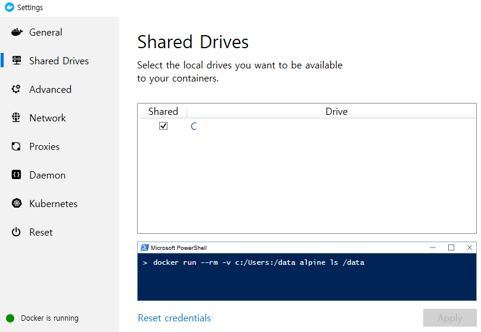

## Docker Swarm

- Docker Swarm --> 오케스트레이션
  - 여러 docker host를 클러스터로 묶어주는 컨테이너 오케스트레이션

|  이름   |                             역할                             | 대응하는 명령어 |
| :-----: | :----------------------------------------------------------: | :-------------: |
| Compose | 여러 컨테이너로 구성된 도커 애플리케이션을 관리(단일 호스트) | docker-compose  |
|  Swarm  |              클러스터 구축 및 관리(멀티 호스트)              |  docker swarm   |
| Service | 스웜에서 클러스터 안의 서비스(컨테이너 하나 이상의 집합)를 관리 | docker service  |
|  Stack  |   스웜에서 여러개의 서비스를 합한 전체 애플리케이션을 관리   |  docker stack   |


- Docker in Docker(Dind)
  - 19.03.5-dind 버전의 도커 사용 (https://hub.docker.com/_/docker)


- Manager에 Swarm 설정
  - https 등록
  - --insecure-registry registry :5000
- `docker-compose.yml` 파일 작성 [강사님 github에서 가져옴](https://github.com/joneconsulting/cloud-computing/tree/master/04.Docker/swarm)

*docker-compose.yml*

```bash
version: "3"
services: 
  registry:
    container_name: registry
    image: registry:latest
    ports: 
      - 5000:5000
    volumes: 
      - "./registry-data:/var/lib/registry"

  manager:
    container_name: manager
    image: docker:19.03.5-dind
    privileged: true
    tty: true
    ports:
      - 8000:80
      - 9000:9000
    depends_on: 
      - registry
    expose: 
      - 3375
    command: "--insecure-registry registry:5000"
    volumes: 
      - "./stack:/stack"

  worker01:
    container_name: worker01
    image: docker:19.03.5-dind
    privileged: true
    tty: true
    depends_on: 
      - manager
      - registry
    expose: 
      - 7946
      - 7946/udp
      - 4789/udp
    command: "--insecure-registry registry:5000"

  worker02:
    container_name: worker02
    image: docker:19.03.5-dind
    privileged: true
    tty: true
    depends_on: 
      - manager
      - registry
    expose: 
      - 7946
      - 7946/udp
      - 4789/udp
    command: "--insecure-registry registry:5000"

  worker03:
    container_name: worker03
    image: docker:19.03.5-dind
    privileged: true
    tty: true
    depends_on: 
      - manager
      - registry
    expose: 
      - 7946
      - 7946/udp
      - 4789/udp
    command: "--insecure-registry registry:5000"
      
```

- `docker-compose up` 실행

  - 윈도우에 비밀번호가 걸려있지 않으면 에러가 발생

  - 사용자 계정에 비밀번호를 설정하고 Docker setting에서 Share Drives의 C 드라이브를 shared해주자
    

    

  

- manager 접속

  - ```bash
    PS C:\Users\HPE\Work\docker\day03\swarm> docker exec -it manager docker swarm init
    ```

    - `docker`명령어가 2번 나온다. `docker swarm init` 이라는 명령어를 `manager`에게 전달한다는 의미

  - manager 의 ps 확인

    ```bash
    PS C:\Users\HPE\Work\docker\day03\swarm> docker exec -it manager docker ps
    CONTAINER ID        IMAGE               COMMAND             CREATED             STATUS              PORTS               NAMES
    ```

    

  - manager의 network 확인

  - swarm의 초기화 작업 실행

    ```bash
    PS C:\Users\HPE\Work\docker\day03\swarm> docker exec -it manager docker swarm init
    Swarm initialized: current node (pq0qlz0lliwn86ntarzm7kd8m) is now a manager.
    
    To add a worker to this swarm, run the following command:
    
        docker swarm join --token SWMTKN-1-6532xt0g71lhnxerecijc7bd7rci2c3104wqbr5i6jho7aodsz-5h7hxozdb8ls5bbo2j9q6mqdw 172.21.0.3:2377
    
    To add a manager to this swarm, run 'docker swarm join-token manager' and follow the instructions.
    ```

- worker와 join

  - 위에 `docker swarm join --token SWMTKN-1-6532xt0g71lhnxerecijc7bd7rci2c3104wqbr5i6jho7aodsz-5h7hxozdb8ls5bbo2j9q6mqdw 172.21.0.3:2377` 부분을 복붙해서 `worker01`부터 `worker03`까지 `manager`와 `join` 시켜준다.

    ```bash
    # woker01 join
    PS C:\Users\HPE\Work\docker\day03\swarm> docker exec -it worker01 docker swarm join --token SWMTKN-1-6532xt0g71lhnxerecijc7bd7rci2c3104wqbr5i6jho7aodsz-5h7hxozdb8ls5bbo2j9q6mqdw 172.21.0.3:2377
    This node joined a swarm as a worker.
    
    # worker02 join
    PS C:\Users\HPE\Work\docker\day03\swarm> docker exec -it worker02 docker swarm join --token SWMTKN-1-6532xt0g71lhnxerecijc7bd7rci2c3104wqbr5i6jho7aodsz-5h7hxozdb8ls5bbo2j9q6mqdw 172.21.0.3:2377
    This node joined a swarm as a worker.
    
    # worker03 join
    PS C:\Users\HPE\Work\docker\day03\swarm> docker exec -it worker03 docker swarm join --token SWMTKN-1-6532xt0g71lhnxerecijc7bd7rci2c3104wqbr5i6jho7aodsz-5h7hxozdb8ls5bbo2j9q6mqdw 172.21.0.3:2377
    This node joined a swarm as a worker.
    ```

  - `docker exec -it manager docker node ls`를 통해 상태 확인

```bash
PS C:\Users\HPE\Work\docker\day03\swarm> docker exec -it manager docker node ls
ID                            HOSTNAME            STATUS              AVAILABILITY        MANAGER STATUS      ENGINE VERSION
pq0qlz0lliwn86ntarzm7kd8m *   102e232f9185        Ready               Active              Leader              19.03.5
wgs00ylcj39dgwcjs9ds6b1gh     442d47f23f7b        Ready               Active                                  19.03.5
u35ivn0q1kc47op9plsr9hld1     869082a41fba        Ready               Active                                  19.03.5
k2fzc718ymgz8ggigoijvuaf9     f53f0c9b3c78        Ready               Active                                  19.03.5
```

