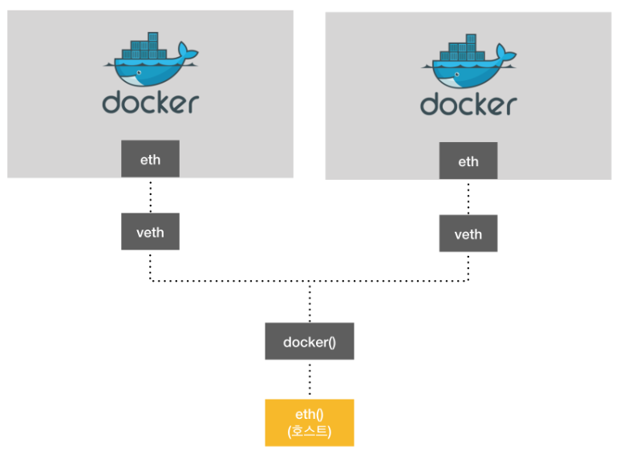

# Docker Network



- `eth` : 도커에서 할당받은 이더넷. 172.02.XX로 시작
- `veth` : 이더넷 카드


#### 네트워크 종류

> Bridge network

- `docker network create --driver bridge [BRIDGE NAME]`

- `docker run` 또는 `docker create`에서 --net 옵션으로 커스텀 브릿지 사용

  

> Host network

- 포트포워딩없이 네트워크 사용

  

> None network

- 네트워크를 사용하지 않음. 외부와 단절

  

> Container network

- 다른 컨테이너의 네트워크 환경공유

- 두 컨테이너 사이의 네티워크 정보가 동일

  

> Overlay network

- 다른 호스트들 간의 네트워크 공유 
- Local 네트워크와 AWS의 네트워크를 묶어서 사용하고 싶을 때
- 스웜, 쿠버네티스를 사용해서 컨테이너를 관리할 때 사용


#### 네트워크 확인

- `docker network ls` : 현재 도커가 실행하고 있는 네트워크 보여줌
- `docker inspect CONTAINERNAME`


# Docker-compose

- `docker-compose version` : docker compose 버전 확인

- `docker run -d -p 9000:8080 busybox/echo:latest -v -e --name ` 이라고 해서 도커 컨테이너를 만들었었다. 하지만 이를 compose로도 생성 가능하다.

- `docker-compose.yml` 파일 생성

  ```bash
  version: "3"
  services:
      echo:
          image: busybox:latest
          ports: 
              - 9000:8080
  ```

  - 실행방법 : `docker-compose up`

- 3개의 서버를 만든걸  compose 하나로 만들 수 있음

  ```bash
  $ docker run --name mongodb_server_1 -d -p 16010:27017 mongo --replSet myapp
  $ docker run --name mongodb_server_2 -d -p 26010:27017 mongo --replSet myapp
  $ docker run --name mongodb_server_3 -d -p 36010:27017 mongo --replSet myapp
  ```

  

### 3개의 컨테이너를 Docker Compose로 만들기

*docker-compose.yml* 

```bash
version: "3"
services:
    mongo1:
        image: "mongo" # mongo라는 이미지가 있어야한다. docker images로 확인
        ports:
            - "16010:27017"
        volumes: 
            - $HOME/mongoRepl/mongo1:/data/db   # : 앞에 있는것 호스트OS가 가지고 있는 주소, : 뒤에 있는게 컨테이너에서의주소 data/db로 옮겨놓겠다.
        networks:
            - mongo-networks
        command: mongod --replSet myapp 

    mongo2:
        image: "mongo"
        ports:
            - "26010:27017"
        volumes: 
            - $HOME/mongoRepl/mongo2:/data/db 
        networks:
            - mongo-networks
        command: mongod --replSet myapp
        depends_on: # mongo1이 동작된 다음에 2번이 동작하도록 하는 옵션
            - mongo1
    
    mongo3:
        image: "mongo" 
        ports:
            - "36010:27017"
        volumes: 
            - $HOME/mongoRepl/mongo3:/data/db 
        networks:
            - mongo-networks
        command: mongod --replSet myapp
        depends_on: # mongo2가 동작된 다음에 3번이 동작하도록 하는 옵션
            - mongo2
networks:
    mongo-networks: # docker network create 와 같은 의미
        driver: bridge
```

- `docker-compose up` 으로 실행

```bash
PS C:\Users\HPE\Work\docker\day03\mongo> docker-compose up
WARNING: The HOME variable is not set. Defaulting to a blank string.
Creating network "mongo_mongo-networks" with driver "bridge"
Creating mongo_mongo1_1 ... done
Creating mongo_mongo2_1 ... done
Creating mongo_mongo3_1 ... done
Attaching to mongo_mongo1_1, mongo_mongo2_1, mongo_mongo3_1
mongo1_1  | 2020-01-02T05:06:27.235+0000 I  CONTROL  [main] Automatically disabling TLS 1.0, to force-enable TLS 1.0 specify --sslDisabledProtocols 'none'
mongo1_1  | 2020-01-02T05:06:27.237+0000 I  CONTROL  [initandlisten] MongoDB starting : pid=1 port=27017 dbpath=/data/db 64-bit host=1c83d8085850
mongo1_1  | 2020-01-02T05:06:27.237+0000 I  CONTROL  [initandlisten] db version v4.2.2
mongo1_1  | 2020-01-02T05:06:27.237+0000 I  CONTROL  [initandlisten] git version: a0bbbff6ada159e19298d37946ac8dc4b497eadf
mongo1_1  | 2020-01-02T05:06:27.237+0000 I  CONTROL  [initandlisten] OpenSSL version: OpenSSL 1.1.1  11 Sep 2018
mongo1_1  | 2020-01-02T05:06:27.237+0000 I  CONTROL  [initandlisten] allocator: tcmalloc
mongo1_1  | 2020-01-02T05:06:27.237+0000 I  CONTROL  [initandlisten] modules: none
mongo1_1  | 2020-01-02T05:06:27.237+0000 I  CONTROL  [initandlisten] build environment:
mongo1_1  | 2020-01-02T05:06:27.237+0000 I  CONTROL  [initandlisten]     distmod: ubuntu1804
mongo1_1  | 2020-01-02T05:06:27.237+0000 I  CONTROL  [initandlisten]     distarch: x86_64
mongo1_1  | 2020-01-02T05:06:27.237+0000 I  CONTROL  [initandlisten]     target_arch: x86_64
mongo1_1  | 2020-01-02T05:06:27.237+0000 I  CONTROL  [initandlisten] options: { net: { bindIp: "*" }, replication: { replSet: "myapp" } }
mongo1_1  | 2020-01-02T05:06:27.238+0000 I  STORAGE  [initandlisten] wiredtiger_open config: create,cache_size=1452M,cache_overflow=(file_max=0M),session_max=33000,eviction=(threads_min=4,threads_max=4),config_base=false,statistics=(fast),log=(enabled=true,archive=true,path=journal,compressor=snappy),file_manager=(close_idle_time=100000,close_scan_interval=10,close_handle_minimum=250),statistics_log=(wait=0),verbose=[recovery_progress,checkpoint_progress],
mongo1_1  | 2020-01-02T05:06:27.769+0000 I  STORAGE  [initandlisten] WiredTiger message [1577941587:769180][1:0x7f63bb193b00], txn-recover: Set global recovery timestamp: (0,0)
mongo1_1  | 2020-01-02T05:06:27.772+0000 I  RECOVERY [initandlisten] WiredTiger recoveryTimestamp. Ts: Timestamp(0, 0)
mongo1_1  | 2020-01-02T05:06:27.774+0000 I  STORAGE  [initandlisten] Timestamp monitor starting
```


### docker exec -it

`docker exec -it mongo_mongo1_1 [OPTION]`

- option에 올 수 있는 것 : bash, mongo, ls  등등 


## Replica Setting

- `mongo db` 접속 : `docker exec -it mongo_mongo1_1 mongo`

- 원래 Replica Setting 은 

  ```bash
  mongo> rs.initiate()
  mongo> rs.add("172.17.0.3:27017")
  mongo> rs.add("172.17.0.4:27017")
  mongo> rs.add("172.17.0.5:27017")
  ```

  처럼 했었다. 이것을 compose로 만들어서 동작시키자.

  

  **방법 1**

  *replication-setting.js*

  ```bash
  rs.initiate();
  rs.add("172.17.0.2:27017"); # 또는 rs.add("mongo1:27017")
  rs.add("172.17.0.3:27017"); # 또는 rs.add("mongo2:27017")
  rs.add("172.17.0.4:27017"); # 또는 rs.add("mongo3:27017")
  ```

  > ip 확인 하는 방법 
  >
  > - `docker network ls` 에 들어가서 mongo_mongo-networks가 있는지 확인한다.
  >
  > - `docker network inspect NETWORK ID`를 하면 mongo_mongo1_1, mongo_mongo2_1, mongo_mongo3_1 의 ip를 볼 수 있다.
  > - 이 ip는 가변적이므로 ip 대신 아이디를 쓸 수 있다.

  - js 파일로 만든것을 mongo의 172.17.0.3:27017에 request 되어 위의 4줄을 실행시킬 수 있다.

    ```bash
    root@1c83d8085850:/# mongo 172.17.0.4:27017 replication-setting.js
    ```

    

  **방법 2**
  
  *replication-setting.js*

  ```bash
  config={
      _id: "myapp",
      members: [
          {_id:0, host: "mongo1:27017"},
          {_id:1, host: "mongo2:27017"},
          {_id:2, host: "mongo3:27017"},
      ]
  };
  rs.initiate(config);
  rs.config();
  ```

  *Dockerfile*

  ```bash
  FROM mongo:latest
  
  WORKDIR /usr/src
  RUN mkdir mongo_config
  WORKDIR /usr/src/mongo_config
  
  COPY replication-setting.js .
  CMD ["mongo", "mongodb://mongo1:27017", "./replication-setting.js"]
  ```

  

  > *실습*  - docker-compose.yml 파일에 새로운 service(container)추가 

1. Dockerfile 생성(위의 Dockerfile 사용)

2. image 빌드

   `docker build -t mongodb_settings:latest .`

   ```bash
   PS C:\Users\HPE\Work\docker\day03\mongo> docker build -t mongodb_settings:latest .
   Sending build context to Docker daemon  43.52kB
   Step 1/6 : FROM mongo:latest
    ---> a0e2e64ac939
   Step 2/6 : WORKDIR /usr/src
    ---> Using cache
    ---> 4b3c7d53a69e
   Step 3/6 : RUN mkdir mongo_config
    ---> Using cache
    ---> d1f36c47c30a
   Step 4/6 : WORKDIR /usr/src/mongo_config
    ---> Using cache
    ---> 67ce2278edb8
   Step 5/6 : COPY replication-setting.js .
    ---> Using cache
    ---> 447143bfea42
   Step 6/6 : CMD ["mongo", "mongodb://mongo1:27017", "./replication-setting.js"]
    ---> Running in 4f70fb34e740
   Removing intermediate container 4f70fb34e740
    ---> 1af61e78c074
   Successfully built 1af61e78c074
   Successfully tagged mongodb_settings:latest
   SECURITY WARNING: You are building a Docker image from Windows against a non-Windows Docker host. All files and directories added to build context will have '-rwxr-xr-x' permissions. It is recommended to double check and reset permissions for sensitive files and directories.
   PS C:\Users\HPE\Work\docker\day03\mongo> docker exec -it mongo_mongo1_1 mongo
   MongoDB shell version v4.2.2
   connecting to: mongodb://127.0.0.1:27017/?compressors=disabled&gssapiServiceName=mongodb
   Implicit session: session { "id" : UUID("b23d3443-4cbd-4da4-9d27-b2092cef1e8f") }
   MongoDB server version: 4.2.2
   Server has startup warnings:
   2020-01-02T06:53:39.763+0000 I  CONTROL  [initandlisten]
   2020-01-02T06:53:39.763+0000 I  CONTROL  [initandlisten] ** WARNING: Access control is not enabled for the database.
   2020-01-02T06:53:39.763+0000 I  CONTROL  [initandlisten] **          Read and write access to data and configuration is unrestricted.
   2020-01-02T06:53:39.763+0000 I  CONTROL  [initandlisten]
   ---
   Enable MongoDB's free cloud-based monitoring service, which will then receive and display
   metrics about your deployment (disk utilization, CPU, operation statistics, etc).
   
   The monitoring data will be available on a MongoDB website with a unique URL accessible to you
   and anyone you share the URL with. MongoDB may use this information to make product
   improvements and to suggest MongoDB products and deployment options to you.
   
   To enable free monitoring, run the following command: db.enableFreeMonitoring()
   To permanently disable this reminder, run the following command: db.disableFreeMonitoring()
   ---
   ```

   

3. image 실행(컨테이너 생성)

   ```bash
   PS C:\Users\HPE\Work\docker\day03\mongo> docker run mongodb_settings:latest
   MongoDB shell version v4.2.2
   connecting to: mongodb://mongo1:27017/test?compressors=disabled&gssapiServiceName=mongodb
   2020-01-02T06:32:23.517+0000 E  QUERY    [js] Error: couldn't connect to server mongo1:27017, connection attempt failed: HostNotFound: Could not find address for mongo1:27017: SocketException: Host not found (authoritative) :
   connect@src/mongo/shell/mongo.js:341:17
   @(connect):2:6
   2020-01-02T06:32:23.519+0000 F  -        [main] exception: connect failed
   2020-01-02T06:32:23.519+0000 E  -        [main] exiting with code 1
   ```

   - errmassage 발생 : 

4. docker-compos.yml 파일에 새로운 service(container) 추가

   ```bash
   version: "3"
   services:
       mongo1:
           image: "mongo" # mongo라는 이미지가 있어야한다. docker images로 확인
           ports:
               - "16010:27017"
           volumes: 
               - $HOME/mongoRepl/mongo1:/data/db   # : 앞에 있는것 호스트OS가 가지고 있는 주소, : 뒤에 있는게 컨테이너에서의주소 data/db로 옮겨놓겠다.
           networks:
               - mongo-networks
           command: mongod --replSet myapp 
   
       mongo2:
           image: "mongo"
           ports:
               - "26010:27017"
           volumes: 
               - $HOME/mongoRepl/mongo2:/data/db 
           networks:
               - mongo-networks
           command: mongod --replSet myapp
           depends_on: # mongo1이 동작된 다음에 2번이 동작하도록 하는 옵션
               - mongo1
       
       mongo3:
           image: "mongo" 
           ports:
               - "36010:27017"
           volumes: 
               - $HOME/mongoRepl/mongo3:/data/db 
           networks:
               - mongo-networks
           command: mongod --replSet myapp
           depends_on: # mongo2가 동작된 다음에 3번이 동작하도록 하는 옵션
               - mongo2
       # setup 부분을 새로 추가
       mongodbsetup:
           image: "mongodb_settings"
           depends_on: 
               - mongo3
           networks: 
               - mongo-networks
   
   networks:
       mongo-networks: # docker network create 와 같은 의미
           driver: bridge
   ```

   

5. docker-compose up 후 Primary 접속, Secondary와 동기화

   - `docker exec -it mongo_mongo1_1 mongo`

   - Primary에 bookstore DB 생성

     ```bash
     myapp:PRIMARY> show dbs
     admin   0.000GB
     config  0.000GB
     local   0.000GB
     myapp:PRIMARY> use bookstore;
     switched to db bookstore
     myapp:PRIMARY> db.books.save({title:"Docker-Mongo-01"});
     WriteResult({ "nInserted" : 1 })
     myapp:PRIMARY> db.books.save({title:"Docker-Mongo-02"});
     WriteResult({ "nInserted" : 1 })
     myapp:PRIMARY> db.books.save({title:"Docker-Mongo-03"});
     WriteResult({ "nInserted" : 1 })
     myapp:PRIMARY> db.books.find()
     { "_id" : ObjectId("5e0d948b4cf9f33be3693486"), "title" : "Docker-Mongo-01" }
     { "_id" : ObjectId("5e0d948e4cf9f33be3693487"), "title" : "Docker-Mongo-02" }
     { "_id" : ObjectId("5e0d94904cf9f33be3693488"), "title" : "Docker-Mongo-03" }
     ```

     

   - Secondary에서 DB 확인

     `docker exec -it mongo_mongo2_1 mongo`

     ```bash
     myapp:SECONDARY> rs.slaveOk();
     myapp:SECONDARY> show dbs
     admin      0.000GB
     bookstore  0.000GB
     config     0.000GB
     local      0.000GB
     myapp:SECONDARY> use bookstore
     switched to db bookstore
     myapp:SECONDARY> db.books.find()
     { "_id" : ObjectId("5e0d948b4cf9f33be3693486"), "title" : "Docker-Mongo-01" }
     { "_id" : ObjectId("5e0d948e4cf9f33be3693487"), "title" : "Docker-Mongo-02" }
     { "_id" : ObjectId("5e0d94904cf9f33be3693488"), "title" : "Docker-Mongo-03" }
     ```

     `docker exec -it mongo_mongo3_1 mongo`

     ```bash
     myapp:SECONDARY> rs.slaveOk();
     myapp:SECONDARY> show dbs
     admin      0.000GB
     bookstore  0.000GB
     config     0.000GB
     local      0.000GB
     myapp:SECONDARY> use bookstore
     switched to db bookstore
     myapp:SECONDARY> db.books.find();
     { "_id" : ObjectId("5e0d948b4cf9f33be3693486"), "title" : "Docker-Mongo-01" }
     { "_id" : ObjectId("5e0d948e4cf9f33be3693487"), "title" : "Docker-Mongo-02" }
     { "_id" : ObjectId("5e0d94904cf9f33be3693488"), "title" : "Docker-Mongo-03" }
     ```

     

   

