## Openstack : 클라우드 운영체제

##### 200107 화요일 Openstack 기초

- 클라우드 컴퓨팅

  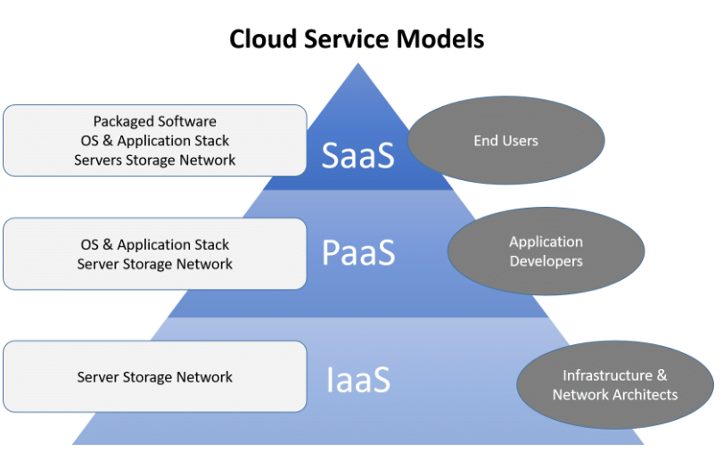

  - SaaS : 사용한 만큼만 비용을 내는 서비스 - 일반 사용자(개인/기업)
  - PaaS : 관리형 서비스(Provider가 관리). IaaS를 구축하기 위한 자동화가 되어 있어서 인프라를 따로 구축할 필요가 없음. 자동화+관리형 - 개발자가 주 사용자
  - IaaS : IT관계자가 주 사용자. 사용자가 직접 관리를 해야함
    - 시장 점유율 : SaaS(60%) > IaaS(30%) > PaaS(10%)
  - PaaS와 IaaS를 Public/Private Cloud로 나누는 기준
    - Public Cloud : 누구나(개인/기업) 사용 가능
    - Private Cloud : 제한적 사용자(해당 기업의 사원들 등)
  - 수요 예측이 어려워서 Hybrid cloud를 운용하고 싶을 때 openstack를 활용할 수 있다.
  - openstack는 클라우드 운영체제.

- Public Cloud : AWS, Azure, GCP 
- Private Cloud : Openstack
- K&S : PaaS, SaaS에 가까운 솔루션
- Openstack : IaaS에 가까운 솔루션. Openstack이 좀 더 포괄적임 
  
  - ex) Openstack magnum : K&S를 지원하는 솔루션


- AWS의 DNS 서비스 : Route53, 고가용성 100%


- Vmware 설치
- 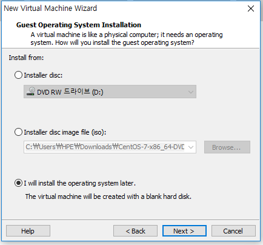
- 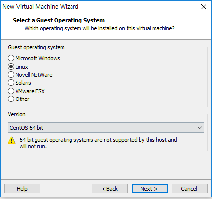
- 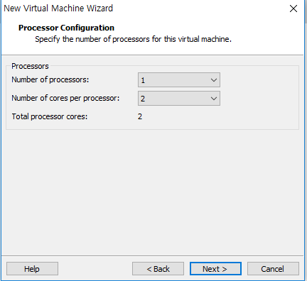
- 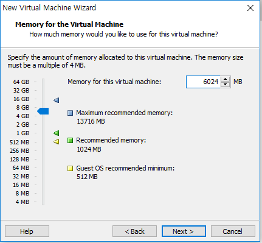
- 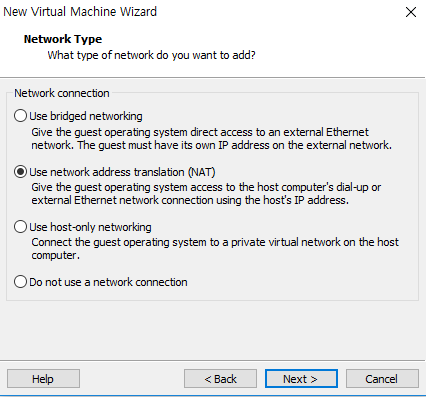
- 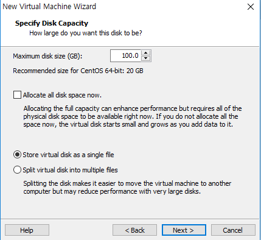
- 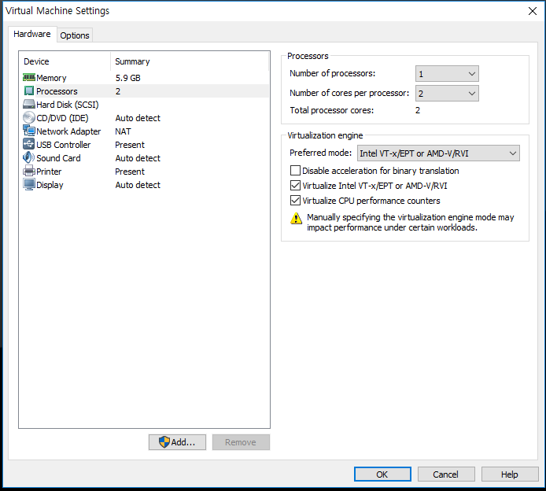
- 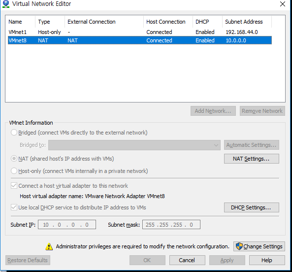
  - 기존에 있던 NAT를 삭제하고, VMnet8로 다시 만든다


- Xshell 
-  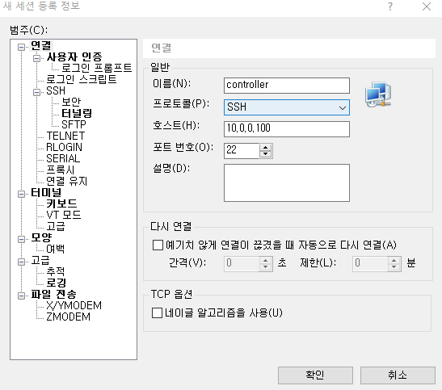

- hosts 파일 설정 `vi /etc/hosts`
- 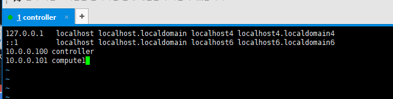


- Xshell에서 사용한 명령어

  ```powershell
  [root@controller ~]# history
      1  yum update -y
      2  ifconfig
      3  reboot
      4  cls
      5  clear
      6  systemctl stop firewalld
      7  systemctl disable firewalld
      8  systemctl disable NetworkManager
      9  systemctl stop NetworkManager
     10  yum -y install chrony
     11  vi etc/hosts
     12  vi /etc/hosts
     13  yum install -y centos-release-openstack-rocky
     14  yum repolist
     15  yum update -y
  
  ```

- `compute1`도 `controller`에 만들어 놓은 `controller.vmdk` 파일을 새롭게 만든 폴더인 compute1에 복사해 놓는다.  

