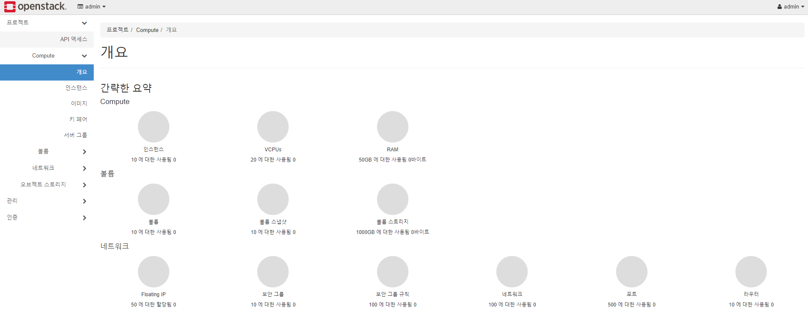
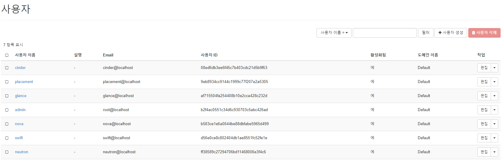
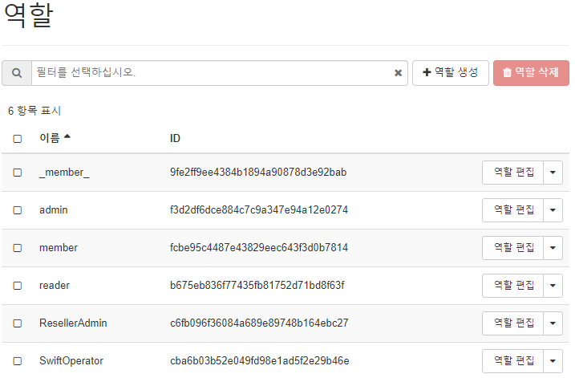
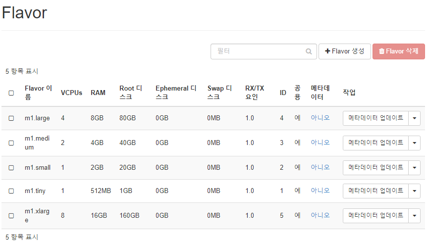
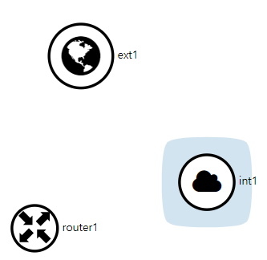
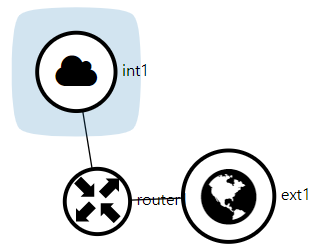
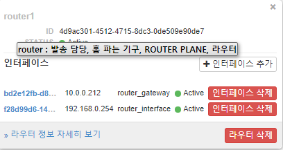

## Openstack : Packstack을 이용한 all-in-one 구성

##### 200108 수요일


- 리눅스에서 보안을 위해 사용하는 것

  - 방화벽 : firewalld(version 7) . port가 오픈되어있는지만 확인함

    - 호스트 기반 방화벽
    - 서버쪽에 리눅스가 설치되어 있고, Internet쪽에 Network 방화벽을 설치
    -  리눅스에서는 Host 기반 방화벽 사능

  - SELinux : Label기반 Access 제어

    - 사용자 : `id -a` 

      ```powershell
      [root@controller ~]# id -a
      uid=0(root) gid=0(root) groups=0(root) context=unconfined_u:unconfined_r:unconfined_t:s0-s0:c0.c1023
      ```

    - Process : `ps -efZ`

    - Resource : `ls -lZ`File, Directory, Service port 

      ```powershell
      [root@controller ~]# ls -l
      합계 4
      -rw-------. 1 root root 1660  1월  7 16:25 anaconda-ks.cfg
      [root@controller ~]# ls -lZ
      -rw-------. root root system_u:object_r:admin_home_t:s0 anaconda-ks.cfg
      ```

      

- 방화벽 설정

  ```powershell
  [root@controller ~]# systemctl stop firewalld
  [root@controller ~]# systemctl disable firewalld
  [root@controller ~]# systemctl disable NetworkManager
  [root@controller ~]# systemctl stop NetworkManager
  ```

- 

  - SETLINUX 를 꺼주기 위해 SELINUX=disabled 시켜줌

    ```powershell
    # This file controls the state of SELinux on the system.
    # SELINUX= can take one of these three values:
    #     enforcing - SELinux security policy is enforced.
    #     permissive - SELinux prints warnings instead of enforcing.
    #     disabled - No SELinux policy is loaded.
    SELINUX=disabled
    # SELINUXTYPE= can take one of three two values:
    #     targeted - Targeted processes are protected,
    #     minimum - Modification of targeted policy. Only selected processes are protected.
    #     mls - Multi Level Security protection.
    SELINUXTYPE=targeted
    
    ```

  - `setenforce` : SELinux의 모드를 제한. 

  - `getenforce` : SELinux의 모드 상태 확인

    ```powershell
    [root@controller ~]# setenforce 0
    [root@controller ~]# getenforce
    Permissive
    
    ```

    

  - `/etc/chrony.conf` 설정

  ```powershell
  # Use public servers from the pool.ntp.org project.
  # Please consider joining the pool (http://www.pool.ntp.org/join.html).
  server 0.centos.pool.ntp.org iburst
  server 1.centos.pool.ntp.org iburst
  #server 2.centos.pool.ntp.org iburst
  #server 3.centos.pool.ntp.org iburst
  server 2.kr.pool.ntp.org.iburst
  server 127.127.1.0
  
  allow 10.0.0.0/24
  ```
  - `chrony` 재시작

    ```powershell
    [root@controller ~]# systemctl restart chronyd
    [root@controller ~]# systemctl status chronyd
    
    ```

  - `chrony`의 source 확인

    ```powershell
    root@controller ~]# chronyc sources
    210 Number of sources = 3
    MS Name/IP address         Stratum Poll Reach LastRx Last sample               
    ===============================================================================
    ^? 127.127.1.0                   0   6     0     -     +0ns[   +0ns] +/-    0ns
    ^+ ec2-54-180-134-81.ap-nor>     2   6    17     3   +269us[ +269us] +/-   51ms
    ^* dadns.cdnetworks.co.kr        2   6    17     5   -466us[ -466us] +/-   59ms
    
    ```

    

#### ---- 여기까지 하면 controller가 클라이언트이자 서버가 된다----


- `Packstack` 설치 : `yum install -y openstack-packstack*`

- `gen-answer-file` : 비밀번호를 랜덤으로 사용하지 않고 미리 저장해주는 파일 


```powershell
[root@controller ~]# vi /root/openstack.txt
[root@controller ~]# packstack --gen-answer-file /root/openstack.txt
Packstack changed given value  to required value /root/.ssh/id_rsa.pub

```

- `openstack.txt` 파일을 복사해두자

```powershell
[root@controller ~]# cp /root/openstack.txt /root/openstack.old
[root@controller ~]# vi /root/openstack.txt
```

- `diff`명령어를 사용하여 복사해둔 old 파일과 수정한 파일을 비교

```powershell

[root@controller ~]# diff /root/openstack.txt /root/openstack.old
11c11  # 11번 라인이 바뀌었다. 
< CONFIG_DEFAULT_PASSWORD=abc123 # '<'기호가 수정후의 파일 내용
---
> CONFIG_DEFAULT_PASSWORD=
46c46
< CONFIG_CEILOMETER_INSTALL=n
---
> CONFIG_CEILOMETER_INSTALL=y
50c50
< CONFIG_AODH_INSTALL=n
---
> CONFIG_AODH_INSTALL=y
326c326
< CONFIG_KEYSTONE_ADMIN_PW=abc123
---
> CONFIG_KEYSTONE_ADMIN_PW=0d91da9ff9dc4773
873c873
< CONFIG_NEUTRON_OVS_BRIDGE_IFACES=br-ex:ens33
---
> CONFIG_NEUTRON_OVS_BRIDGE_IFACES=
1185,1186c1185
< CONFIG_PROVISION_DEMO=n
< 
---
> CONFIG_PROVISION_DEMO=y
```


- `packstack` 설치하자
  - `[root@controller ~]# time packstack --answer-file=/root/openstack.txt`
  - `time` 키워드를 주면 시간을 알 수 있음

- `packstack` 설치 후 `10.0.0.100` 으로 접속

  - 로그인 정보 확인 : `cat keystonerc_admin `

    ```powershell
    [root@controller ~]# ls
    anaconda-ks.cfg  keystonerc_admin  openstack.old  openstack.txt
    [root@controller ~]# cat keystonerc_admin 
    unset OS_SERVICE_TOKEN
        export OS_USERNAME=admin
        export OS_PASSWORD='abc123'
        export OS_REGION_NAME=RegionOne
        export OS_AUTH_URL=http://10.0.0.100:5000/v3
        export PS1='[\u@\h \W(keystone_admin)]\$ '
        
    export OS_PROJECT_NAME=admin
    export OS_USER_DOMAIN_NAME=Default
    export OS_PROJECT_DOMAIN_NAME=Default
    export OS_IDENTITY_API_VERSION=3
    ```

    - 사용자 이름 : admin, 비밀번호 : abc123

- 변경된 network 정보를 확인해보자

  ```powershell
  [root@controller network-scripts]# cat ifcfg-ens33
  DEVICE=ens33
  NAME=ens33
  DEVICETYPE=ovs
  TYPE=OVSPort
  OVS_BRIDGE=br-ex
  ONBOOT=yes
  BOOTPROTO=none # 
  
  [root@controller network-scripts]# ip a s br-ex
  6: br-ex: <BROADCAST,MULTICAST,UP,LOWER_UP> mtu 1500 qdisc noqueue state UNKNOWN group default qlen 1000
      link/ether 00:0c:29:f0:8e:0a brd ff:ff:ff:ff:ff:ff
      inet 10.0.0.100/24 brd 10.0.0.255 scope global br-ex # 10.0.0.100으로 나와있어야 함
         valid_lft forever preferred_lft forever
      inet6 fe80::343b:84ff:fed9:db4b/64 scope link 
         valid_lft forever preferred_lft forever
  
  [root@controller network-scripts]# ip a s ens33
  2: ens33: <BROADCAST,MULTICAST,UP,LOWER_UP> mtu 1500 qdisc pfifo_fast master ovs-system state UP group default qlen 1000
      link/ether 00:0c:29:f0:8e:0a brd ff:ff:ff:ff:ff:ff
      inet6 fe80::20c:29ff:fef0:8e0a/64 scope link 
         valid_lft forever preferred_lft forever
  ```

- `[root@controller network-scripts]# ovs-vsctl show`

  ```powershell
  8b461496-da6f-4537-bd55-858860548c94
      Manager "ptcp:6640:127.0.0.1"
          is_connected: true
      Bridge br-tun
          Controller "tcp:127.0.0.1:6633"
              is_connected: true
          fail_mode: secure
          Port patch-int
              Interface patch-int
                  type: patch
                  options: {peer=patch-tun}
          Port br-tun
              Interface br-tun
                  type: internal
      Bridge br-int
          Controller "tcp:127.0.0.1:6633"
              is_connected: true
          fail_mode: secure
          Port patch-tun
              Interface patch-tun
                  type: patch
                  options: {peer=patch-int}
          Port int-br-ex
              Interface int-br-ex
                  type: patch
                  options: {peer=phy-br-ex}
          Port br-int
              Interface br-int
                  type: internal
      Bridge br-ex
          Controller "tcp:127.0.0.1:6633"
              is_connected: true
          fail_mode: secure
          Port "ens33"
              Interface "ens33"
          Port phy-br-ex
              Interface phy-br-ex
                  type: patch
                  options: {peer=int-br-ex}
          Port br-ex
              Interface br-ex
                  type: internal
      ovs_version: "2.11.0"
  ```


- Horizon 접속 : `10.0.0.100`



- 인증은 `keystone` 서비스를 사용하는 것. 아래는 `keystone`의 서비스 목록이다. 

  - cf) 리눅스는 /etc/password에 사용자 목록이 저장되어 있다

  


- 관리자는 `admin`, 일반 사용자는 `_member_`을 사용

  


- 호스트 집합(Availabity zone) : 관리목적
- 가용 존 : 사용자들이 사용할 수 있는 존


- 프로젝트 : 사용자 목적
  - Compute
  - 볼륨
  - 네트워크
  - 오브젝트 스토리지(Swift)
    - 컨테이너 
- 관리
  - Compute : Nova
  - 볼륨 : Cinder service
  - 네트워크 : Neutron
  - 시스템 : 관리자 목적
    - 서비스
    - Compute 서비스
    - 블록 스토리지 서비스
    - 네트워크 에이전트


#### 용어 정리

- 프로젝트 : 클라우드 사용자 그룹에 쿼터가 적용(접근제어를 편하게 하기 위해)

- Tenant : 사용자 그룹(프로젝트랑 거의 동일하게 쓰임)

- Flavor : VM profile (관리-Compute-Flavor)

  ------

  

  - Root 디스크는 장치명이 `sda`, Ephemeral 디스크는 장치명이 `sdb`로 설정된다. 만약 디스크가 더 필요하다면 `Cinder`에 요청을 하여 `sdc`디스크를 추가할 수 있다.

- Key-pair : `ssh`로 직접 접근해서 관리 해야할 때 인증 메커니즘으로 필요한 것이다.


------


#### Openstack 서비스 사용하기

- **Horizon**으로 사용 및 관리하기 : 전체 *flow*

  

  - 프로젝트 생성

    - 이름 : pro1
    - 프로젝트 멤버 : admin 추가
    - 역할 : member와 admin 부여
    - Quotas 수정 : 인스턴스 4개, VCPUs 4

    

  - 사용자 생성

    - 이름 : stack1
    - 최초 프로젝트 : pro1
    - 역할 : member

    ---- *admin 역할을 하는 manager 추가* ----

    - 이름 : mgr1
    - 최초 프로젝트 : pro1
    - 역할 : admin

    

  - Flavor 생성(*AWS의 인스턴스*)

    - 이름 : a.tiny
    - 접근권한 : pro1 부여

     ---- *누구나 쓰는 Flavor 추가*----

    - 이름 : a.nano
    - 접근권한 : 없음

  ---- *여기까지 admin에서 작업, 밑에부터는 stack1(user1)에서 작업* ----

  - Network 생성
    - 이름 : int1
    - 서브넷 생성
      - 이름 : subint1
      - 네트워크 주소 192.168.0.0/24
      - 게이트웨이 IP : 192.168.0.254
      - DNS 네임서버 : 10.0.0.2
    - 이름 : ext1
    - 서브넷 생성
      - 이름 : subext1
      - 네트워크 주소 : 10.0.0.0/24
      - 게이트웨이 IP : 10.0.0.2
      - DHCP 사용 X
      - Pools 할당 : 10.0.0.210,10.0.0.220
      - DNS 네임서버 : 10.0.0.2

  

  - Router 생성

    - 이름 : router1

      ----*게이트웨이 설정을 위해 mgr1 또는 admin으로 접속한다.*----

      - 관리 - 네트워크 - 네트워크 - ext1의 네트워크 편집 : 관리 상태 활성화, 공유 

      ----*다시 stack1으로 접속한다.*----

      - 네트워크 토폴로지를 확인하면 이러한 모양이 나온다

        

        

        - 네트워크 토폴로지에서 router1에서 인터페이스를 추가한다.
          - subint1 추가
          - 네트워크 - 라우터 - 게이트웨이 설정 : 외부 네트워크와 연결

        

        - 네트워크 토폴로지 확인

        

        

        

  

  #### 정리

  ```txt
  Day2 (13:00~ )
  ----------------------------------------------------------
  1.컨트롤러 준비작업
     os update,/etc/hosts,ntp server 구축,centos 최적화(filrewalld/NetworkManager/SELinux),repository 추가
  
  2.오픈스택 설치(packstack on centos)
  vi /etc/chrony.conf
  ----------------------------------------------------
  server 0.centos.pool.ntp.org iburst
  server 1.centos.pool.ntp.org iburst
  #server 2.centos.pool.ntp.org iburst
  #server 3.centos.pool.ntp.org iburst
  server 2.kr.pool.ntp.org iburst
  server 127.127.1.0 
  
  allow 10.0.0.0/24
  -----------------------------------------------------
  vi openstack.txt
  -----------------------------------------------------
  326 CONFIG_KEYSTONE_ADMIN_PW=abc123
  1185 CONFIG_PROVISION_DEMO=n
  11 CONFIG_DEFAULT_PASSWORD=abc123
  46 CONFIG_CEILOMETER_INSTALL=n
   50 CONFIG_AODH_INSTALL=n
  873 CONFIG_NEUTRON_OVS_BRIDGE_IFACES=br-ex:ens33
  ----------------------------------------------------------------------------
  
  3.packstack을 이용한 all-in-one 구성
  
  4.오픈스택 서비스 사용하기
  
  Horizon 접속
  Horizon 메뉴
  Openstack 용어 정의
  프로젝트/사용자 /Flavor 생성 
  
  --------------------------------------------------------------------------
  네트워크/라우터
  Floating IP용: ext1->subext1->10.0.0.0/24,gw: 10.0.0.2, dns:10.0.0.2,dhcp X, 사용 IP pool(10.0.0.210,10.0.0.220),외부네트워크
  Fixed IP 용: int1->subint1->192.168.0.0/24,gw:192.168.0.254,dns:10.0.0.2,dhcp 활성화)
  router1 생성
  외부 네트워크과 router간 연결: 게이트웨이 설정
  내부 네트워크와 router간 연결: 인터페이스 추가
  --------------------------------------------------------------------------
  ```

  

  

  

  

  - Security Group 생성
  - Key pair 생성
  - Floating IP 생성
  - Image 생성
  - Instance 생성
  - Volume/snapshot 생성
  - Object storage 사용


