## Openstack : Horizon - DashBoard Service

##### 200109 목요일

- CIDR 방식 : 클래스가 없는 도메인 간 라우팅 기법. 기존 IP할당 방식인 네트워크 클래스를 대체. 

- 보안그룹 : 방화벽 정책. 반드시 적용해야 함

  - 블랙리스트 정책 : 전부 open, 몇몇을 제한
  - 화이트리스트 정책 : 전부 close, 서비스가 가능한 몇몇 포트를 허용
    - cf) : http : 80번포트, https : 443번 포트, ssh : 22번 포트, ping : ICMP프로토콜

- **Horizon**으로 **Dashboard service**사용 및 관리하기 : *day2에서 5. Router 생성까지 완료한 상태*

  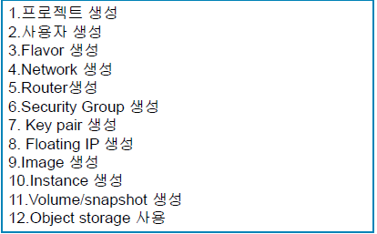

  - Security Group 생성

    - default 보안그룹을 적용 : 인스턴스들이 default 보안그룹의 멤버가 된다. --> 내부통신은 가능하나, 외부 통신은 불가능한 상태

    - 이름 : class1

    - 아웃바운드(내보냄) : IPv4, IPv6 둘 다 모두허용

    - 인바운드(들어옴) : TCP 프로토콜(SSH, HTTP), ICMP - CIDR 방식으로 적용

      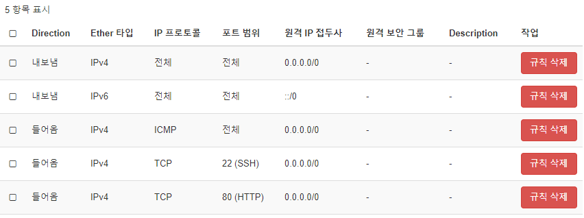

      

  - Key Pair 생성

    - console 접근 방식 : 인스턴스가 네트워크 설정이 안되었다고 하더라도 관리자로 로그인이 가능한 상황. novncprotocol, CLI 사용 
    - remote 접속 : ssh 프로토콜 사용하여 통신. 
      - ssh의 인증 방식 : 
        - password 기반 인증(default)
        - key-pair 기반 인증(비대칭키 알고리즘) : public key, private key
    - compute - 키페어 접속

    

  - Floating IP 생성 : 내부 인스턴스에 공인 IP 할당 

    - mgr1과 stack1이 공유 가능한 공인 IP
    - 사용하지 않는 IP는 과금이 부여

    

  - Image 생성 : 리눅스 배포판, [cirros cloud download](http://download.cirros-cloud.net/0.3.5/)

    - `cirros-0.3.5-x86_64-disk.img  ` 다운로드 --> 이미지를 `glance`에 등록
    - 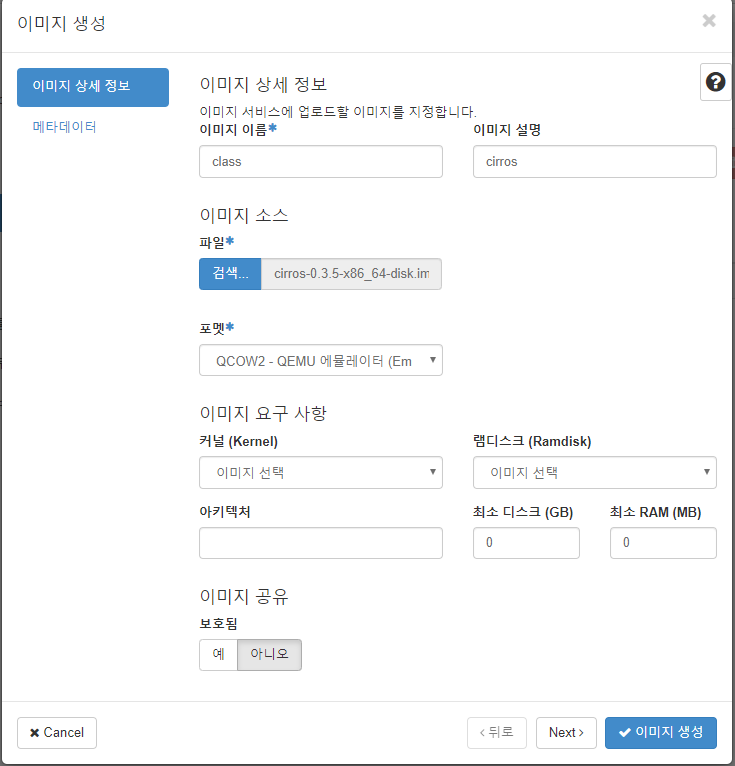

  - Instance 생성

    - glance 저장소에 `ciros image`가 저장이 되어있다. 

      - 저장소 위치 지정 : nova(이미지) 또는 cinder(새 볼륨에 생성) 사용
      - 이름 : class_instance, 이미지 
      - Flavor : a.nano
      - 네트워크 : int1
      - 보안 그룹 : class 1
      - 인스턴스 생성 후 
        - 인스턴스 이름을 눌러서 상태를 볼 수 있다
        - 로그에서 로그인 정보를 확인할 수 있다.
          - id :  cirros
          - password: cubswin:)

      

      ------

      > cf) yum install -y openstack-utils : openstack의 status 를 볼 수 있게 해주는 패키지 Xshell에서 다운받자.

      - `openstack-status` 확인 결과

        ```powershell
        [root@controller ~]# openstack-status
        == Nova services ==
        openstack-nova-api:                     active
        openstack-nova-compute:                 active
        openstack-nova-network:                 inactive  (disabled on boot)
        openstack-nova-scheduler:               active
        openstack-nova-conductor:               active
        openstack-nova-console:                 inactive  (disabled on boot)
        openstack-nova-consoleauth:             active
        openstack-nova-xvpvncproxy:             inactive  (disabled on boot)
        == Glance services ==
        openstack-glance-api:                   active
        openstack-glance-registry:              active
        == Keystone service ==
        openstack-keystone:                     inactive  (disabled on boot)
        == Horizon service ==
        openstack-dashboard:                    active
        == neutron services == # 이쪽이 active 되어 있어야 함
        neutron-server:                         active
        neutron-dhcp-agent:                     active
        neutron-l3-agent:                       active
        neutron-metadata-agent:                 active
        neutron-openvswitch-agent:              active
        neutron-metering-agent:                 active
        == Cinder services ==
        openstack-cinder-api:                   active
        openstack-cinder-scheduler:             active
        openstack-cinder-volume:                active
        openstack-cinder-backup:                active
        == Support services ==
        openvswitch:                            active
        dbus:                                   active
        target:                                 active
        rabbitmq-server:                        active
        memcached:                              active
        == Keystone users ==
        Warning keystonerc not sourced
        ```

        - 만약 문제가 발생했다면 
          -  `neutron-openvswitch-agent:              inactive` 되어 있다면 `systemctl start neutron-openvswitch-agent`

      

    - 유동 IP 할당 : 인스턴스 항목의 작업 탭에서 `유동 ip 연결 설정`

      - 외부에서 접속이 필요한 인스턴스에만 유동 ip를 부여해주면 된다
      - 만약 유동 IP를 해제하려면 Floating IP에서 유동 ip 해제를 하고, 반납까지 해야한다

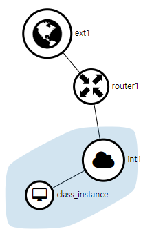

- 볼륨 생성 

  - 볼륨 - 볼륨 생성

  - 볼륨 편집 - 인스턴스 연결 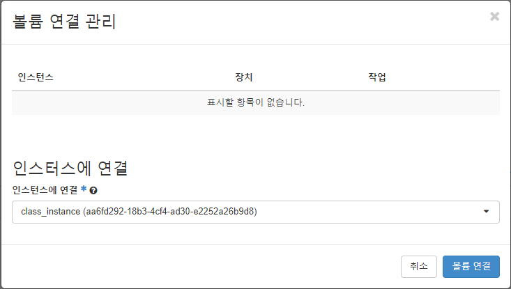

    

    *파일 시스템 포맷*

  - 연결이 잘 되었는지 확인해보기 위해 콘솔 창에서 `lsblk` 입력 

    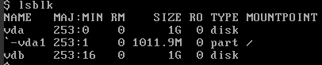

    - `vdb`로 새로운 디스크가 생성되었다.

  - `fdisk` 라는 유틸리티를 사용하여 /dev/vdb 로 파티셔닝 - 관리자 권한

    - 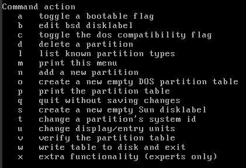
    - 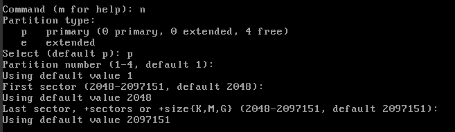
      - 영어 명령어 `n`, `p` 외엔 엔터치고 넘어간다
    - `lsblk`로 확인 
    - 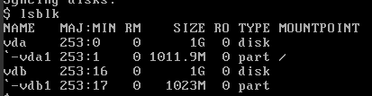
      - `mkfs -t ext4 /dev/vdb1` 하여 파일 시스템 포맷
      - `mount /dev/vdb1/ app` 로 마운트
      - `df -h`로 확인
      - 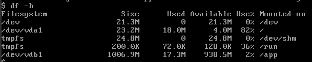
      - `cp /etc/p* /app`  하여 데이터 복사

  ------

  #### Password 기반 Instance 접속

- ssh로 로그인 : 인스턴스 `cirros`의 유동 ip인 `10.0.0.210`으로 Xshell에서 접속 --> 외부에서 공인 ip로 들어가는 방식. packstack에서 설정이 빠져있어서 router로 접속함

  ```powershell
  [root@controller ~]# ssh cirros@10.0.0.210
  ssh: connect to host 10.0.0.210 port 22: No route to host
  # 접속 오류 route를 통해서 들어가야 함
  ```

  - 라우터에 접속하자 : 라우터 id 확인 `ip netns`

  ```powershell
  [root@controller ~]# ip netns
  qrouter-4d9ac301-4512-4715-8dc3-0de509e90de7 (id: 1) # 라우터 id 확인
  qdhcp-6f33c9c4-1c91-41b6-93cb-e956a97eb489 (id: 0)
  [root@controller ~]# ip netns exec qrouter-4d9ac301-4512-4715-8dc3-0de509e90de7 /bin/sh
  sh-4.2# 
  ```

  - 다시 ssh로 로그인(유동 ip : 10.0.0.210) `pw: cubwin:)`

    ```powershell
    sh-4.2# ssh cirros@10.0.0.210
    The authenticity of host '10.0.0.210 (10.0.0.210)' can't be established.
    RSA key fingerprint is SHA256:ERJJ90+AxHt7TX6KWjP7MLM4NCJXeA2w5IQsctbrRUo.
    RSA key fingerprint is MD5:09:2e:da:ef:54:e5:20:2c:db:ad:0b:49:86:83:ed:fb.
    Are you sure you want to continue connecting (yes/no)? y
    Please type 'yes' or 'no': yes
    Warning: Permanently added '10.0.0.210' (RSA) to the list of known hosts.
    cirros@10.0.0.210's password:  #pw : cubswin:)
    $   
    
    ```

  - `lsblk`로 볼륨 확인

    ```powershell
    $ lsblk
    NAME   MAJ:MIN RM    SIZE RO TYPE MOUNTPOINT
    vda    253:0    0      1G  0 disk 
    `-vda1 253:1    0 1011.9M  0 part /
    vdb    253:16   0      1G  0 disk 
    `-vdb1 253:17   0   1023M  0 part /app
    ```

  

  ------

  #### Key 기반 Instance 접속

- stack1 을 생성하며 발급받은 개인키를 사용하여 Instance에 접속 - setting - options 

  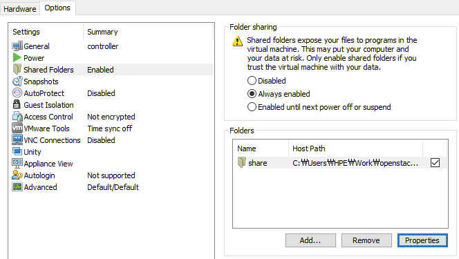

- Xshell로 접속

  - ```powershell
    [root@controller ~]# vmhgfs-fuse /mnt
    fuse: mountpoint is not empty
    fuse: if you are sure this is safe, use the 'nonempty' mount option
    ```

  - 현재 디스크 공간 확인

    ```powershell
    [root@controller ~]# df -h
    Filesystem           Size  Used Avail Use% Mounted on
    devtmpfs             2.8G     0  2.8G   0% /dev
    tmpfs                2.8G  4.0K  2.8G   1% /dev/shm
    tmpfs                2.8G   29M  2.8G   1% /run
    tmpfs                2.8G     0  2.8G   0% /sys/fs/cgroup
    /dev/mapper/cl-root   60G  3.2G   57G   6% /
    /dev/sda1           1014M  180M  835M  18% /boot
    /dev/loop0           1.9G  6.1M  1.7G   1% /srv/node/swiftloopback
    /dev/mapper/cl-home   10G   33M   10G   1% /home
    tmpfs                567M     0  567M   0% /run/user/0
    vmhgfs-fuse          931G  126G  806G  14% /mnt/hgfs
    ```

  - 

  - `mnt`폴더로 이동하고 개인키를 root에 복사

  - ```powershell
    [root@controller ~]# cd /mnt/hgfs/
    [root@controller hgfs]# cd share/
    [root@controller share]# ls
    stack1-key1.pem
    [root@controller share]# cp stack1-key1.pem /root
    ```

  - `ip netns` : 프로세스 네트워크 네임스페이스 관리. 

    ```powershell
    [root@controller share]# ip netns
    qrouter-4d9ac301-4512-4715-8dc3-0de509e90de7 (id: 1)
    qdhcp-6f33c9c4-1c91-41b6-93cb-e956a97eb489 (id: 0)
    [root@controller share]# ip netns exec qrouter-4d9ac301-4512-4715-8dc3-0de509e90de7 ssh -i /root/stack1-key1.pem cirros@10.0.0.210
    # 권한 때문에 오류가 발생한다.
    @@@@@@@@@@@@@@@@@@@@@@@@@@@@@@@@@@@@@@@@@@@@@@@@@@@@@@@@@@@
    @         WARNING: UNPROTECTED PRIVATE KEY FILE!          @
    @@@@@@@@@@@@@@@@@@@@@@@@@@@@@@@@@@@@@@@@@@@@@@@@@@@@@@@@@@@
    Permissions 0755 for '/root/stack1-key1.pem' are too open.
    It is required that your private key files are NOT accessible by others.
    This private key will be ignored.
    Load key "/root/stack1-key1.pem": bad permissions
    cirros@10.0.0.210's password: 
    
    ```

  - 권한을 새로 부여(`chmod 600`)하고 다시 접속 및 `key` 기반 인증 되는지 확인

    ```powershell
    [root@controller share]# chmod 600 /root/stack1-key1.pem 
    [root@controller share]# ip netns exec qrouter-4d9ac301-4512-4715-8dc3-0de509e90de7 ssh -i /root/stack1-key1.pem cirros@10.0.0.210
    $ ls .ssh
    authorized_keys
    $ cat .ssh/authorized_keys 
    ssh-rsa AAAAB3NzaC1yc2EAAAADAQABAAABAQDhoehoJNX/lZ2A7d5R0Pd76d/IjW6lWKgCU5ir9GBmJapBi13lCogzFChuExANq8yX0gJGYp2uSW5NjPUxU1cdEiqN/j9Qaf9LnzRhfAtYDtgE46Mb1fi0In7Fv1CVnqfPWMQIyjJgnLYOtgLMpUqx6fEF25e+sJb42LnvDgpBygQO+fq7dV6Ecso3R/coXrrKo4ZslxNRmHZyh7FkMk89Xfdu1K0xs4OofSJi3Qy1ffyV1eWa1Jf0N4GwFwKbA0IUoq91pxlSgH3xk+UFTb5+8YwWVzPHdhTJ9T9MwfBZgbFyMlc2ib/LGHRBUTr+FO6xqgH4QB08w2202DQPZ5bl Generated-by-Nova
    
    ```

    

  - `lsblk` : 현재 연결된 저장장치 확인, `df -h` : 디스크 공간 확인, 마운트 정보 확인

    ```powershell
    $ lsblk
    NAME   MAJ:MIN RM    SIZE RO TYPE MOUNTPOINT
    vda    253:0    0      1G  0 disk 
    `-vda1 253:1    0 1011.9M  0 part /
    vdb    253:16   0      1G  0 disk 
    `-vdb1 253:17   0   1023M  0 part 
    
    $ df -h
    Filesystem                Size      Used Available Use% Mounted on
    /dev                     21.3M         0     21.3M   0% /dev
    /dev/vda1                23.2M     18.0M      4.0M  82% /
    tmpfs                    24.8M         0     24.8M   0% /dev/shm
    tmpfs                   200.0K     72.0K    128.0K  36% /run
    ```

    - `vda` 는 `root`에 mount 되어있고, `vdb` 는 어디에 마운트 되어있는거지?

  -  Snapshot 생성 : Vm단위 백업, 볼륨 백업 가능

    - **Vm단위 Snapshot**: ` root`디스크 백업 -> Snapshot을 가지고 새로운 `Instance`로 올릴수 있음/ OS를 바게 쓰고 백업가능

      - `Compute`의 인스턴스에서 스냅샷 생성
      - 바로 `이미지의 스냅샷`으로 넘어간다.

    - **Volume Snapshot** : `Cinder`에 대한 백업  -> Snapshot을 가지고 새로운` Volume`을 만들어서 다른 Instance로 붙일 수 있음. 어플리케이션 데이터. 

    - **Mount** : 

      - `$ sudo mount /dev/vdb1 /app`

    - **Umont**

      - umont : `sudo umount` 

        ```powershell
        $ df -h
        Filesystem                Size      Used Available Use% Mounted on
        /dev                     21.3M         0     21.3M   0% /dev
        /dev/vda1                23.2M     18.0M      4.0M  82% /
        tmpfs                    24.8M         0     24.8M   0% /dev/shm
        tmpfs                   200.0K     72.0K    128.0K  36% /run
        /dev/vdb1              1006.9M     17.3M    938.5M   2% /app
        
        
        $ sudo umount /app
        $ df -h
        Filesystem                Size      Used Available Use% Mounted on
        /dev                     21.3M         0     21.3M   0% /dev
        /dev/vda1                23.2M     18.0M      4.0M  82% /
        tmpfs                    24.8M         0     24.8M   0% /dev/shm
        tmpfs                   200.0K     72.0K    128.0K  36% /run
        
        ```

        - `/dev/vdb`1의 `mount`가  사라졌다.

        ```powershell
        $ lsblk
        NAME   MAJ:MIN RM    SIZE RO TYPE MOUNTPOINT
        vda    253:0    0      1G  0 disk 
        `-vda1 253:1    0 1011.9M  0 part /
        vdb    253:16   0      1G  0 disk 
        `-vdb1 253:17   0   1023M  0 part 
        $ 
        
        # 하지만 아직 연결은 되어있음
        ```

      - detach : 연결 해제. 인스턴스에서 볼륨을 없애 버리는 것


### OpenStack CLI로 관리 하기

- **Idnetity 서비스 (Keystone)**
  - 사용자: 
  - Credentials:  
  - 인증 : 사용자의 신원을 확인
  - 토큰 : 사용자에게 임의의 bit를 적용
  - Tenant : 쿼터(resource limit)가 적용된 사용자 그룹 . 프로젝트와 동일한 개념
  - 서비스 : 
  - 엔드포인트 : 해당 서비스가 올라간 url 형태로 등록
  - 역할 :  역할이 부여되야 인증된 사용자도 서비스를 사용할 수 있다.


- MariDB 접속 - 여기서 테이블들을 확인할 수 있음 --> 굳이 이거로 안써도 된다

  ```powershell
  [root@controller ~]# mysql -uroot
  Welcome to the MariaDB monitor.  Commands end with ; or \g.
  Your MariaDB connection id is 315
  Server version: 10.1.20-MariaDB MariaDB Server
  
  Copyright (c) 2000, 2016, Oracle, MariaDB Corporation Ab and others.
  
  Type 'help;' or '\h' for help. Type '\c' to clear the current input statement.
  
  MariaDB [(none)]> use keystone
  
  MariaDB [keystone]> select * from project;
  +----------------------------------+--------------------------+-------+--------------------------
  | id                               | name                     | extra | description              
  +----------------------------------+--------------------------+-------+--------------------------
  | 77ffca45d38c41e1bc19a24d42ef2e25 | pro1                     | {}    | The first project        
  | 897bd30a8b2940d2892bb1e89b90bb93 | services                 | {}    | Tenant for the openstack 
  | <<keystone.domain.root>>         | <<keystone.domain.root>> | {}    |                          
  | default                          | Default                  | {}    | The default domain       
  | fc99ded67493405faf07f8b365d5a81c | admin                    | {}    | admin tenant             
  +----------------------------------+--------------------------+-------+-------------------------
  ```

- keystone에서 CLI로 확인하자

  ```powershell
  [root@controller ~]# ls
  anaconda-ks.cfg  keystonerc_admin  openstack.old  openstack.txt  stack1-key1.pem
  [root@controller ~]# cat keystonerc_admin 
  unset OS_SERVICE_TOKEN
      export OS_USERNAME=admin   # export는 전역변수로 선언할 떄의 명령어
      export OS_PASSWORD='abc123'
      export OS_REGION_NAME=RegionOne
      export OS_AUTH_URL=http://10.0.0.100:5000/v3
      export PS1='[\u@\h \W(keystone_admin)]\$ '  # Prompt 모양 바꿀 때 쓰는 것
      
  export OS_PROJECT_NAME=admin
  export OS_USER_DOMAIN_NAME=Default
  export OS_PROJECT_DOMAIN_NAME=Default
  export OS_IDENTITY_API_VERSION=3
  ```

- 환경 파일을 수정, 적용할 때 사용하는 명령어 : `.`

- ```powershell
      [root@controller ~]# . keystonerc_admin 
  [root@controller ~(keystone_admin)]# openstack user list
  +----------------------------------+-----------+
  | ID                               | Name      |
  +----------------------------------+-----------+
  | 08ed6db3ee6f45c7b403cdc21d5b9f63 | cinder    |
  | 3a5027d38da241318be0759d9061504a | mgr1      |
  | 9eb8934cc9144c1999c77f207e2a5305 | placement |
  | af715504fa254408b10e2cca428c232d | glance    |
  | b2f4ac0551c34d6c930703c5abc426ad | admin     |
  | b583ce1e6a0644be88dbfabe5965d499 | nova      |
  | d56e0ce8c802404db1ae8551fc52fe1e | swift     |
  | e1483cb825d7442084d1fd2de675cbf9 | stack1    |
  | ff38589c27294706bd11468006e3f4c6 | neutron   |
  +----------------------------------+-----------+
  
  [root@controller ~(keystone_admin)]# openstack project list
  +----------------------------------+----------+
  | ID                               | Name     |
  +----------------------------------+----------+
  | 77ffca45d38c41e1bc19a24d42ef2e25 | pro1     |
  | 897bd30a8b2940d2892bb1e89b90bb93 | services |
  | fc99ded67493405faf07f8b365d5a81c | admin    |
  +----------------------------------+----------+
  
  ```

- 사용자 별 권한 확인

- ```powershell
  [root@controller ~(keystone_admin)]# openstack role list --user admin --project admin
  Listing assignments using role list is deprecated. Use role assignment list --user <user-name> -project <project-name> --names instead.
  +----------------------------------+-------+---------+-------+
  | ID                               | Name  | Project | User  |
  +----------------------------------+-------+---------+-------+
  | f3d2df6dce884c7c9a347e94a12e0274 | admin | admin   | admin |
  +----------------------------------+-------+---------+-------+
  
  [root@controller ~(keystone_admin)]# openstack role list --user stack1 --project pro1
  Listing assignments using role list is deprecated. Use role assignment list --user <user-name> --project <project-name> --names instead.
  +----------------------------------+----------+---------+--------+
  | ID                               | Name     | Project | User   |
  +----------------------------------+----------+---------+--------+
  | 9fe2ff9ee4384b1894a90878d3e92bab | _member_ | pro1    | stack1 |
  +----------------------------------+----------+---------+--------+
  ```

- 사용자를 admin에서 stack1으로 바꾸자

- ```powershell
  [root@controller ~(keystone_admin)]# cp keystonerc_admin keystonerc_stack1
  [root@controller ~(keystone_admin)]# cp keystonerc_admin keystonerc_stack1
  # keystonerc_stack1 파일 내용
  unset OS_SERVICE_TOKEN
      export OS_USERNAME=stack1
      export OS_PASSWORD='abc123'
      export OS_REGION_NAME=RegionOne
      export OS_AUTH_URL=http://10.0.0.100:5000/v3
      export PS1='[\u@\h \W(keystone_stack1)]\$ '
     
  export OS_PROJECT_NAME=pro1
  export OS_USER_DOMAIN_NAME=Default
  export OS_PROJECT_DOMAIN_NAME=Default
  export OS_IDENTITY_API_VERSION=3
  [root@controller ~(keystone_admin)]# . keystonerc_stack1
  # Prompt 변경 완료
  [root@controller ~(keystone_stack1)]# 
  
  ```

- CLI로 관리(Demo사용자 생성)

  - Demo사용자 만들기 (프로젝트 생성 -> )

  - ```powershell
    [root@controller ~(keystone_admin)]# openstack project create --description "Demo Project" demo
    +-------------+----------------------------------+
    | Field       | Value                            |
    +-------------+----------------------------------+
    | description | Demo Project                     |
    | domain_id   | default                          |
    | enabled     | True                             |
    | id          | 409815e34c9b42fabc5951bb4e6f132d |
    | is_domain   | False                            |
    | name        | demo                             |
    | parent_id   | default                          |
    | tags        | []                               |
    +-------------+----------------------------------+
    
    [root@controller ~(keystone_admin)]# openstack user create --password abc123 --project demo demo
    +---------------------+----------------------------------+
    | Field               | Value                            |
    +---------------------+----------------------------------+
    | default_project_id  | 409815e34c9b42fabc5951bb4e6f132d |
    | domain_id           | default                          |
    | enabled             | True                             |
    | id                  | 42cf65add9b94766b195df9fdf2ea478 |
    | name                | demo                             |
    | options             | {}                               |
    | password_expires_at | None                             |
    +---------------------+----------------------------------+
    
    
    
    [root@controller ~(keystone_admin)]# openstack role add --user demo --project demo _member_
    
    [root@controller ~(keystone_admin)]# openstack role list --user demo --project demo
    Listing assignments using role list is deprecated. Use role assignment list --user <user-name> --project <project-name> --names instead.
    +----------------------------------+----------+---------+------+
    | ID                               | Name     | Project | User |
    +----------------------------------+----------+---------+------+
    | 9fe2ff9ee4384b1894a90878d3e92bab | _member_ | demo    | demo |
    +----------------------------------+----------+---------+------+
    
    
    ```

  - ```powershell
    [root@controller ~(keystone_admin)]# cp keystonerc_admin keystonerc_demo
    [root@controller ~(keystone_admin)]# vi keystonerc_demo 
    
    # keystonerc_demo 파일에서 admin을 전부 demo로 바꾼다. 
    # 명령어 = :%s admin/demo
    ...
    
    
    [root@controller ~(keystone_admin)]# . keystonerc_demo
    
    # 토큰 생성
    [root@controller ~(keystone_demo)]# openstack token issue
    +------------+-----------------------------------------------------------------------------------------------------------------------------------------------------------------------------------------+
    | Field      | Value                                                                                                                                                                                   |
    +------------+-----------------------------------------------------------------------------------------------------------------------------------------------------------------------------------------+
    | expires    | 2020-01-09T09:12:53+0000                                                                                                                                                                |
    | id         | gAAAAABeFuCFLvDc9oXrz1y0fqozGmzQblfbYS_S4uIqxY7rB4KPn2T5cCokMdX7L5xcKZu3NFkcIyS8aOzIexF1EsW7IkNNL8w-8Cpg4y0pJTwuLicVvZpplIOG54RYIhFBreHL0UoV4wPUFK3lOqE2hrCOtTqKKuoi2pmAG5_NObK9lkoLhaM |
    | project_id | 409815e34c9b42fabc5951bb4e6f132d                                                                                                                                                        |
    | user_id    | 42cf65add9b94766b195df9fdf2ea478                                                                                                                                                        |
    +------------+------------------------------------------------------------------------------------------------------------------------------------------------------------------------
    -----------------+
    Manual 설치
    ```


- 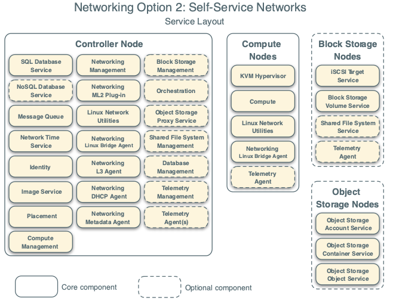