## Openstack 

##### 200114 화요일

- 호스트 네임 바꾸기 

  - `hostnamectl set-hostname [HOSTNAME]`

- ip 바꾸기 : `vi /etc/sysconfig/network-scripts/ifcfg-ens33`

  - UUID 주석처리

  - ipaddr 을 바꾸기

    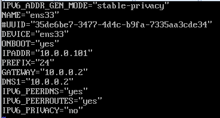

- `systemctl restart network`로 네트워크 다시시작


#### [compute1 추가하기](https://docs.openstack.org/nova/rocky/install/compute-install-rdo.html)

- `[root@compute1 ~]# yum install openstack-nova-compute`

- 파일 복사/전송 : `scp`, `sftp`

  - `scp` : 

  - ```powershell
    # 기존의 파일 먼저 백업
    [root@compute1 ~]# cp /etc/nova/nova.conf /etc/nova/nova.conf.old
    
  # controller에 있는 /etc/nova/nova.conf 파일을 compute1의 /etc/nova로 복사
    [root@compute1 ~]# scp controller:/etc/nova/nova.conf /etc/nova
    ```
    
    
    

- `/etc/nova/nova.conf` 에서 2개의 변수 변경

  - `my_ip` 변경
    
    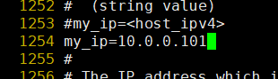
    
  - `vncserver proxyclient_address` 바꾸기 
    
    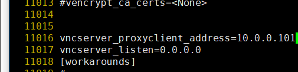

  

- `controller`에 있는 `nova.conf`파일을 `compute1`로 복사하기.

  ```powershell
  # 우선 기존의 nova.conf 파일을 백업해둔다 
  [root@compute1 ~]# cp /etc/nova/nova.conf /etc/nova/nova.conf.old 
  
  # scp를 사용해서 controller의 nova.conf 파일을 compute1으로 복사한다.
  [root@compute1 ~]# scp controller:/etc/nova/nova.conf /etc/nova
  The authenticity of host 'controller (10.0.0.100)' can't be established.
  ECDSA key fingerprint is SHA256:7fvSqgC+nRjBBrT5q3p5pi70PgCiSGOQTmFLnkdnYwE.
  ECDSA key fingerprint is MD5:db:04:fd:59:96:08:cb:25:60:ae:7e:99:fc:53:d2:91.
  Are you sure you want to continue connecting (yes/no)? yes
  Warning: Permanently added 'controller,10.0.0.100' (ECDSA) to the list of known hosts.
  root@controller's password: 
  nova.conf                                                                    100%  385KB  23.0MB/s   00:00    
  [root@compute1 ~]# ls -l /etc/nova/nova.conf
  -rw-r-----. 1 root nova 394479  1월 14 09:47 /etc/nova/nova.conf
  [root@compute1 ~]# vi /etc/nova/nova.conf
  
  ```

  

- 시스템 재시작

  ```powershell
  [root@compute1 ~]# systemctl enable libvirtd.service openstack-nova-compute.service
  Created symlink from /etc/systemd/system/multi-user.target.wants/openstack-nova-compute.servtemd/system/openstack-nova-compute.service.
  [root@compute1 ~]# systemctl start libvirtd.service openstack-nova-compute.service
  ```

- 위에서 저 상태에서 진행이 되지 않는다. `controller`에서 방화벽 작업을 해줘야 시스템이 올라온다 `controller`로 들어가자

  ```powershell
  [root@controller ~(keystone_stack1)]# vi /etc/sysconfig/iptables
  .
  .
  .
  # 13번 라인 아래에 추가
  -A INPUT -s 10.0.0.101/32 -p tcp -m multiport --dports 5671,5672 -m comment --comment "001 amqp incoming amqp_10.0.0.101" -j ACCEPT
  -A INPUT -s 10.0.0.101/32 -p tcp -m multiport --dports 5671,5672 -j ACCEPT
  -A INPUT -s 10.0.0.100/32 -p tcp -m multiport --dports 5671,5672 -j ACCEPT
  ```

- 서비스 reload
  
  ```powershell
  [root@controller ~(keystone_stack1)]# systemctl reload iptables
  [root@controller ~(keystone_stack1)]# . keystonerc_admin
  [root@controller ~(keystone_admin)]# openstack compute service list --service nova-co
  +----+--------------+------------+------+---------+-------+--------------------------+
  | ID | Binary       | Host       | Zone | Status  | State | Updated At               |
  +----+--------------+------------+------+---------+-------+--------------------------+
  |  6 | nova-compute | controller | nova | enabled | up    | 2020-01-14T01:01:00.00000|
  |  7 | nova-compute | compute1   | nova | enabled | up    | 2020-01-14T01:01:06.00000|
  +----+--------------+------------+------+---------+-------+--------------------------+
  ```

- `compute1`에서 서비스가 제대로 올라왔는지 확인

  ```powershell
  [root@compute1 ~]# systemctl status libvirtd.service 
  ● libvirtd.service - Virtualization daemon
     Loaded: loaded (/usr/lib/systemd/system/libvirtd.service; enabled; vendor preset: enabled
     Active: active (running) since 화 2020-01-14 09:52:34 KST; 9min ago
       Docs: man:libvirtd(8)
             https://libvirt.org
   Main PID: 2444 (libvirtd)
      Tasks: 17 (limit: 32768)
     CGroup: /system.slice/libvirtd.service
             └─2444 /usr/sbin/libvirtd
  
  ```

- `discovery compute hosts`

  ```powershell
  [root@controller ~(keystone_admin)]# su -s /bin/sh -c "nova-manage cell_v2 discover_hosts --verbose" nova
  Found 2 cell mappings.
  Skipping cell0 since it does not contain hosts.
  Getting computes from cell 'default': 2e9deec8-1b05-454b-b913-8f94bd2e3525
  Checking host mapping for compute host 'compute1': 0f97b9f0-49e2-45cb-9f2a-61f2e88932fb
  Creating host mapping for compute host 'compute1': 0f97b9f0-49e2-45cb-9f2a-61f2e88932fb
  Found 1 unmapped computes in cell: 2e9deec8-1b05-454b-b913-8f94bd2e3525 # 1개 찾음
  ```

- 300초 마다 discovery 할 수 있게 `scheduler`밑에 인터벌을 추가

  ```powershell
  [root@controller ~(keystone_admin)]# vi /etc/nova/nova.conf
  .
  .
  .
  9662 [scheduler]
  9663 discover_hosts_in_cells_interval = 300
  ```

- compute1에 아직 인스턴스를 올릴 수 없다. neutron 쪽의 agent가 설치되어야 완성되는 것


##### Network Service(NEUTRON)

- 가상 네트워크 환경을 위한 네트워크 측면의 모든것을 관리
- L2 Layer
- 방화벽 : 호스트
- 대시보드에서 라우터 생성을 하면
  
  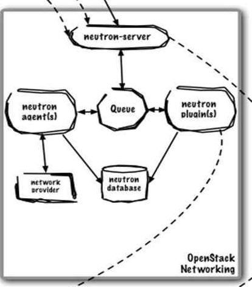
  
  - L2 메커니즘 드라이브 지원 : KVM에서 가장 많이 지원한다.
  - 컨트롤 노드 : 컨트롤러를 처리하는 
- 네트워크 노드 : L3, DHCP, L2 
  - 컴퓨트 노드 : 실제 인스턴스가 올라감. L2
  
- Neutron 분리 구조

  - Private Cloud 구축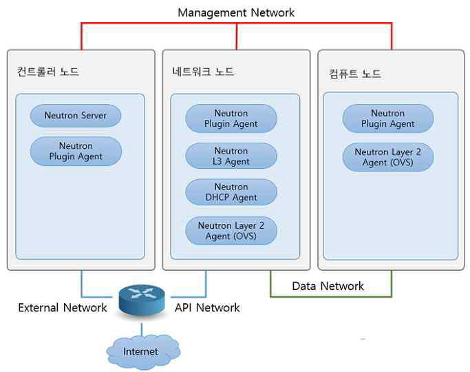
  - 컨트롤러 노드 : 라우터 요청 처리
  - 네트워크 노드 : 컨테이너가 위치함
  - 컴퓨트 노트 : 실제 인스턴스가 올라감. Hypervisor 기반의 KVM이 올라감
  - `ip netns` : 라우터 ID 확인
  - NAT로 형태로 작동하여 외부 네트워크와 접속 가능
  - 외부 네트워크 인터페이스 필요 

- ML2 

  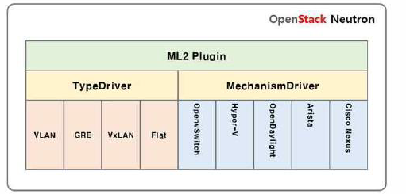

  - TypeDriver : 라우터와 인스턴스를 연결하는 방식. 인스턴스 간 통신을 위해서 데이터 네트워크에 적용되어지는 타입.

    - VLAN : 각각 인스턴스에 VLAN ID 적용, 물리적인 스위치에 오버헤드를 주지 않음. ID를 약 4000개 까지 사용 가능
      - OVS에서 제공하는 가상 스위치 :  `br-int` 
    - VxLAN : VLAN ID를 16,000,000개 까지 사용 가능
    - GRE
    - Flat : 가장 심플한 방식. 물리적인 망과 연동하는 방식

  - Mechanism Driver 

  - 

- Neutron에서 인스턴스에 대한 연결을 제공하는 네트워크의 종류
  - Provicer networks :
    - openstack 관리자가 생성
  - Self-service networks
    - 사용자 생성 network
    - Tenant Network : 내부 네트워크

- `ext-list` : neutron 기능

- `br-ex` : 외부 네트워크 연결 브릿지 

- `DVR` : `br-ex`가 컴퓨트 노드에 네트워크의 병목 구간을 해소

- linuxbridge-agent를 사용 : openvswitch를 사용하지 않음

  - br-ex를 사용하지 않고 linux bridge를 사용

  - 물리적으로 인터페이스를 연결 가능

    

- all in one 컨트롤러 접속

  ```powershell
  [root@controller ~(keystone_admin)]# neutron agent-list
  neutron CLI is deprecated and will be removed in the future. Use openstack CLI instead.
  +--------------------------------------+--------------------+------------+-------------------+-------+----------------+---------------------------+
  | id                                   | agent_type         | host       | availability_zone | alive | admin_state_up | binary                    |
  +--------------------------------------+--------------------+------------+-------------------+-------+----------------+---------------------------+
  | 1857b2d7-fa9f-4cef-9171-8b7dbd1aca3d | Open vSwitch agent | controller |                   | :-)   | True           | neutron-openvswitch-agent |
  | 598cce24-525c-4af2-9360-93d7dc3a5a44 | L3 agent           | controller | nova              | :-)   | True           | neutron-l3-agent          |
  | 89361803-dd62-4503-afc7-2c1b6a281c5b | Metering agent     | controller |                   | :-)   | True           | neutron-metering-agent    |
  | 9350bc11-19b9-4b60-bcc4-2b600c249973 | DHCP agent         | controller | nova              | :-)   | True           | neutron-dhcp-agent        |
  | b2858fda-257a-4391-aa0b-d6089684a243 | Metadata agent     | controller |                   | :-)   | True           | neutron-metadata-agent    |
  +--------------------------------------+--------------------+------------+-------------------+-------+----------------+---------------------------+
  
  ```

- 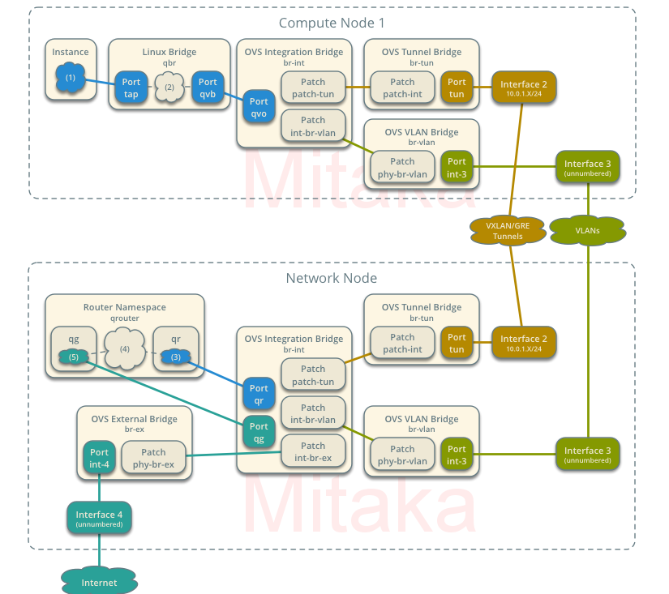
  - compute node 가 통합 브릿지가 된다. 

  - Compute node1과 network node가 터널링 인터페이스를 통해 VLAN으로 연결된 상태

  - Instance : fixed ip(사설 IP) 가 설치되어 있음

  - Router Namespace : floating ip(공인 IP) 관리 - resource pool 형태로 관리. 외부통신 용도

  - 외부에서 DNAT 테이블을 타고  `floating ip` 로 br-ex브릿지를 통해 들어온다. port qg를 통해 라우터로 들어온다. dip를 사용하여 floating ip를 fixed ip로 바꿔주는 작업을 한다. DNAT을 타고 들어감.  Compute node1의 instance로 들어간다.

  - 외부로 나갈 때는 Source IP를 Floating IP로 바꿈 SNAT을 타고 나감.

    

- 네트워크 id 확인 `ip netns`

- ```powershell
  # 네트워크 id 확인
  [root@controller ~(keystone_admin)]# ip netns
  qdhcp-6f33c9c4-1c91-41b6-93cb-e956a97eb489 (id: 1)
  qrouter-4d9ac301-4512-4715-8dc3-0de509e90de7 (id: 0)
  
  # 라우터에 연결
  [root@controller ~(keystone_admin)]# ip netns exec qrouter-4d9ac301-4512-4715-8dc3-0de509e90de7 /bin/bash 
  
  1: lo: <LOOPBACK,UP,LOWER_UP> mtu 65536 qdisc noqueue state UNKNOWN group default qlen 1000
      link/loopback 00:00:00:00:00:00 brd 00:00:00:00:00:00
      inet 127.0.0.1/8 scope host lo
         valid_lft forever preferred_lft forever
      inet6 ::1/128 scope host 
         valid_lft forever preferred_lft forever
  16: qr-f28d99d6-14: <BROADCAST,MULTICAST,UP,LOWER_UP> mtu 1450 qdisc noqueue state UNKNOWN group default qlen 1000
      link/ether fa:16:3e:6b:f4:11 brd ff:ff:ff:ff:ff:ff
      inet 192.168.0.254/24 brd 192.168.0.255 scope global qr-f28d99d6-14
         valid_lft forever preferred_lft forever
      inet6 fe80::f816:3eff:fe6b:f411/64 scope link 
         valid_lft forever preferred_lft forever
  17: qg-bd2e12fb-d8: <BROADCAST,MULTICAST,UP,LOWER_UP> mtu 1450 qdisc noqueue state UNKNOWN group default qlen 1000
      link/ether fa:16:3e:a1:8b:25 brd ff:ff:ff:ff:ff:ff
      inet 10.0.0.212/24 brd 10.0.0.255 scope global qg-bd2e12fb-d8
         valid_lft forever preferred_lft forever
      inet 10.0.0.210/32 brd 10.0.0.210 scope global qg-bd2e12fb-d8
         valid_lft forever preferred_lft forever
      inet6 fe80::f816:3eff:fea1:8b25/64 scope link 
         valid_lft forever preferred_lft forever
  ```

  - 라우터에서 외부 네트워크와 연결 : 게이트웨이 설정 : 
    - 17번 - qg 부분, floating ip 관리
    - 16번 - qr 부분, 
  - 라우터에서 나가려면 `exit` 쓰면된다.

- 사설 ip의 특징 : 밖으로 나가기 위해서는 라우터를 거쳐야된다. 

  - A클래스 사설 ip : 10.0.0.0/8
  - B클래스 사설 ip : 172.16.0.0/16~ 172.31.0.0/16
  - C클래스 사설 ip : 192.168.0.0/24 ~ 192.168.0.0/255


- linux_bridge
  - PROVIDE_INTERFACE_NAME : ens33


- Metadata agent : controller에 있는 db의 neutron 과 compute1 사이를 연결

- `ln -s` : symbolic link를 걸어줌


scp되어온 부분 중 주석처리 


 `/etc/neutron/plugins/ml2/linuxbridge_agent.ini` 수정

- linux_bridge 수정

- 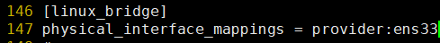

- vxlan 수정

- 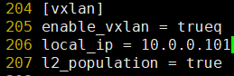

- security group 수정

- 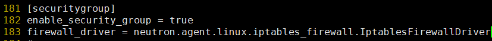

- `ls mod ` : 커널 모듈 볼때. 강제적으로 커널 모듈을 올려줌

- ```powershell
  [root@compute1 neutron]# sysctl -a|grep nf-call
  sysctl: reading key "net.ipv6.conf.all.stable_secret"
  sysctl: reading key "net.ipv6.conf.default.stable_secret"
  sysctl: reading key "net.ipv6.conf.ens33.stable_secret"
  sysctl: reading key "net.ipv6.conf.lo.stable_secret"
  
  [root@compute1 neutron]# lsmod|grep br_netfilter
  [root@compute1 neutron]# modprobe br_netfilter
  
  [root@compute1 neutron]# lsmod|grep br_netfilter
  br_netfilter           22256  0 
  bridge                151336  1 br_netfilter
  
  [root@compute1 neutron]# sysctl -a|grep nf-call
  net.bridge.bridge-nf-call-arptables = 0
  net.bridge.bridge-nf-call-ip6tables = 1
  net.bridge.bridge-nf-call-iptables = 1
  sysctl: reading key "net.ipv6.conf.all.stable_secret"
  sysctl: reading key "net.ipv6.conf.default.stable_secret"
  sysctl: reading key "net.ipv6.conf.ens33.stable_secret"
  sysctl: reading key "net.ipv6.conf.lo.stable_secret"
  
  ```

- ```powershell
  [root@controller ~(keystone_demo)]# openstack router add subnet router selfservice
  
  # stack에서 생성한 라우터가 ext1 임
  [root@controller ~(keystone_demo)]# openstack router set router --external-gateway ext1
  
  ```

- ```powershell
  # admin으로 들어가야 2개의 라우터가 보인다
  [root@controller ~(keystone_admin)]# openstack port list --router router
  +--------------------------------------+------+-------------------+---------------------------------------------------------------------------+--------+
  | ID                                   | Name | MAC Address       | Fixed IP Addresses                                                        | Status |
  +--------------------------------------+------+-------------------+---------------------------------------------------------------------------+--------+
  | 683157d0-c1bf-4d32-b17e-660ea5379e60 |      | fa:16:3e:a6:ee:40 | ip_address='172.16.1.1', subnet_id='63c33884-3f48-49ce-b765-8afcd4f1c58c' | ACTIVE |
  | d52fd6af-9e9a-4e26-9710-ff435b8c4f68 |      | fa:16:3e:67:de:12 | ip_address='10.0.0.216', subnet_id='59e960e5-5af8-46af-90f9-33a9a88ec835' | ACTIVE |
  +--------------------------------------+------+-------------------+---------------------------------------------------------------------------+--------+
  
  ```

- 


#### Block Storage 서비스 : Cinder

- 블록 스토리지 서비스인 Cinder는 iSCSI 프로토콜을 사용한다.

  - Ceph : Block 기반, Object, File
  - Cinder에서는 Volume Group까지 만든다.

- ```powershell
  # cinder-volumes가 보여야 한다
  [root@controller ~(keystone_demo)]# vgs
    VG             #PV #LV #SN Attr   VSize   VFree   
    cinder-volumes   1   4   0 wz--n- <20.60g 1012.00m
    cl               1   3   0 wz--n-  75.75g    4.00m
  
  ```

- ```powershell
  [root@controller ~(keystone_demo)]# pvs
    PV         VG             Fmt  Attr PSize   PFree   
    /dev/loop1 cinder-volumes lvm2 a--  <20.60g 1012.00m
    /dev/sda2  cl             lvm2 a--   75.75g    4.00m
  
  # loop 장치
  [root@controller ~(keystone_demo)]# losetup -a
  /dev/loop0: [64768]:35035735 (/srv/loopback-device/swiftloopback)
  /dev/loop1: [64768]:101206571 (/var/lib/cinder/cinder-volumes)
  ```

- 물리적인 스토리지 : `iSCSI Target`.(서버) . Cinder 서버가 여기에 위치한다.

- 생성된 인스턴스 : `iSCSI Initiator`.(클라이언트) /dev/vdb 밑으로 마운트 해서 사용 가능. 가상으로 붙어있는 것 처럼 제공한다. 기본적으로 dev밑에 장치명이 붙는다. 

- ```powershell
  [root@controller ~(keystone_demo)]# cinder create --name demo-v1 1
  +------------------------------+--------------------------------------+
  | Property                     | Value                                |
  +------------------------------+--------------------------------------+
  | attachments                  | []                                   |
  | availability_zone            | nova                                 |
  | bootable                     | false                                |
  | consistencygroup_id          | None                                 |
  | created_at                   | 2020-01-14T07:51:03.000000           |
  | description                  | None                                 |
  | encrypted                    | False                                |
  | id                           | 57dfa807-f9b1-4f71-bcc5-887cf499e714 |
  | metadata                     | {}                                   |
  | multiattach                  | False                                |
  | name                         | demo-v1                              |
  | os-vol-tenant-attr:tenant_id | 409815e34c9b42fabc5951bb4e6f132d     |
  | replication_status           | None                                 |
  | size                         | 1                                    |
  | snapshot_id                  | None                                 |
  | source_volid                 | None                                 |
  | status                       | creating                             |
  | updated_at                   | None                                 |
  | user_id                      | 42cf65add9b94766b195df9fdf2ea478     |
  | volume_type                  | iscsi                                |
  +------------------------------+--------------------------------------+
  
  ```

- 볼륨 생성완료

  ```powershell
  [root@controller ~(keystone_demo)]# cinder list
  +--------------------------------------+-----------+---------+------+-------------+----------+-------------+
  | ID                                   | Status    | Name    | Size | Volume Type | Bootable | Attached to |
  +--------------------------------------+-----------+---------+------+-------------+----------+-------------+
  | 57dfa807-f9b1-4f71-bcc5-887cf499e714 | available | demo-v1 | 1    | iscsi       | false    |             |
  +--------------------------------------+-----------+---------+------+-------------+----------+-------------+
  
  ```

- 기존 볼륨에 연결하자

  ```powershell
  [root@controller ~(keystone_demo)]# nova volume-attach provider-instance 57dfa807-f9b1-4
  +----------+--------------------------------------+
  | Property | Value                                |
  +----------+--------------------------------------+
  | device   | /dev/vdb                             |
  | id       | 57dfa807-f9b1-4f71-bcc5-887cf499e714 |
  | serverId | f81c8907-b439-4279-8a25-15604067bfa1 |
  | volumeId | 57dfa807-f9b1-4f71-bcc5-887cf499e714 |
  +----------+--------------------------------------+
  
  ```

- 


#### Object Storage Service : Swift

- 구성요소

  - **account**
  - **container**
  - **object**

- 분산과 이중화가 적용되는 아키텍처

- CLI로 사용

  - 컨테이너 생성 : `post`

    ```powershell
    [root@controller ~(keystone_demo)]# swift post c1
    ```

  - 업로드

    ```powershell
    [root@controller ~(keystone_demo)]# swift upload c1 cirros-0.3.5-x86_64-disk.img
    ```

  - 확인

    ```powershell
    [root@controller ~(keystone_demo)]# swift list c1 --lh
     12M 2020-01-14 08:09:52 application/octet-stream cirros-0.3.5-x86_64-disk.img
     12M
    
    ```

  - 다운로드

    ```powershell
    [root@controller ~(keystone_demo)]# cd /var/tmp
    
    [root@controller tmp(keystone_demo)]# swift download c1
    cirros-0.3.5-x86_64-disk.img [auth 0.584s, headers 1.028s, total 1.205s, 21.370 MB/s]
    
    ```


- 고가용성의 기본 : 이중화(모든걸 다 이중화 시킨다)

  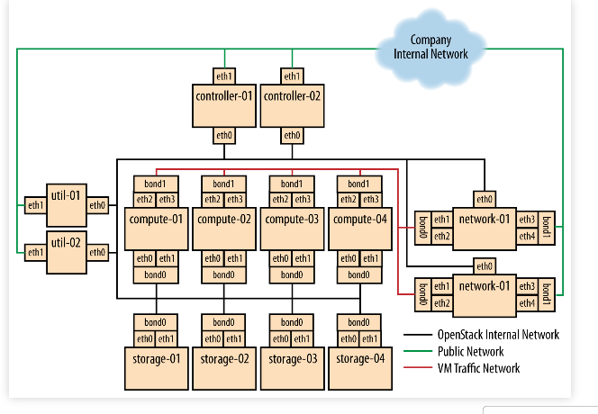

- 

