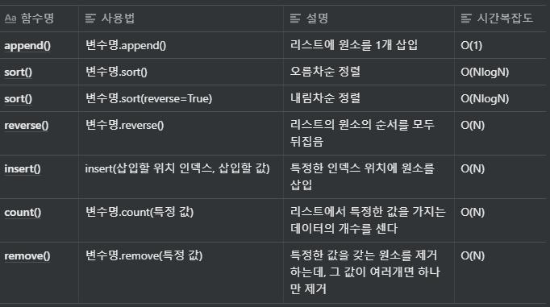

### 기본 문법 정리

**List**

- C++의 vector, Java의 array list와 유사
- 초기화 : 대괄호 사용 [ ]
- 인덱스 접근 가능

```python
a = [1, 2, 3, 4]
print(a[3])
# 실행결과
4

# 크기가 n이고 모든 값이 0인 1차원 리스트 초기화
n = 10
a = [0]*n
print(a)

# 실행결과
[0, 0, 0, 0, 0, 0, 0, 0, 0, 0]
```

- Indexing
    - 양의 정수( 맨 앞부터 시작), 음의 정수 (맨 뒤부터 시작, 맨 뒤는 -1)로 인덱싱 가능

    ```python
    a = [1,2,3]
    print(a[-1])

    # 실행결과
    3
    ```

    - 연속적인 위치를 가져올 떄는 슬라이싱을 사용 : 대괄호 안에 콜론(:)을 넣어서 시작인덱스와 끝 인덱스 설정
        - 끝 인덱스는 실제 인덱스보다 1을 더 크게 설정

        ```python
        a = [1,2,3,4,5]

        # 두번째 원소부터 네 번째 원소까지
        print(a[1:4])

        # 출력결과
        [2,3,4]
        ```

- List comprehension
    - 리스트를 초기화 하는 방법 중 하나
    - 대괄호 안에 조건문과 반복문을 적용하여 리스트를 초기화 가능

    ```python
    # 0부터 9까지 수를 포함하는 리스트
    arr = [i for i in range (10)]

    # 0부터 19까지의 수 중에서 홀수만 포함하는 리스트
    arr = [i for i in range(20) if i % 2 == 1]

    # 1부터 9까지의 수들의 제곱값을 포함하는 리스트
    arr = [i*i for i in range(1,10)]
    ```

    - list comprehension은 2차원 리스트를 초기화 할 때 효과적으로 사용할 수 있다.

    ```python
    # N x M 크기의 이차원 리스트 초기화

    # 좋은 예시
    arr = [[0]*m for _ in range(n)]

    # 나쁜 예시 : 전체 리스트 안에 포함된 각 리스트가 같은 객체로 인식
    arr = [[0]*m]*n 

    n = 3
    m = 2
    arr = [[1]*m for _ in range(n)]
    print(arr)
    # [[1, 1], [1, 1], [1, 1]]

    for i in range(len(arr)):
        for j in range(len(arr[i])):
            print(arr[i][j], end = ' ') # 한 줄 출력을 위함
    # 1 1 1 1 1 1
    ```

    cf) python에서는 반복을 수행할 때, 반복을 위한 변수의 값을 무시하기 위해 언더바( _ )를 많이 사용한다.

- list 관련 메서드

